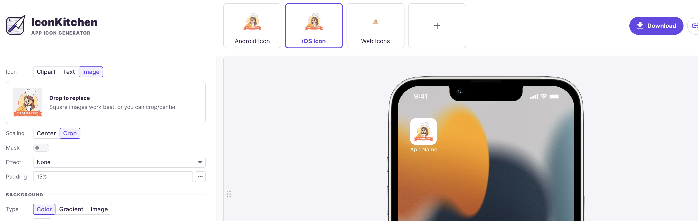
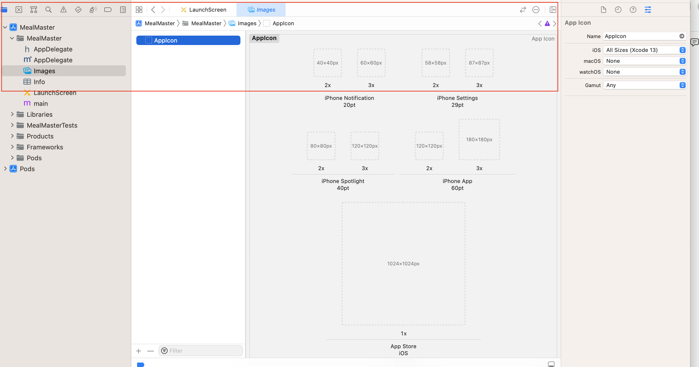
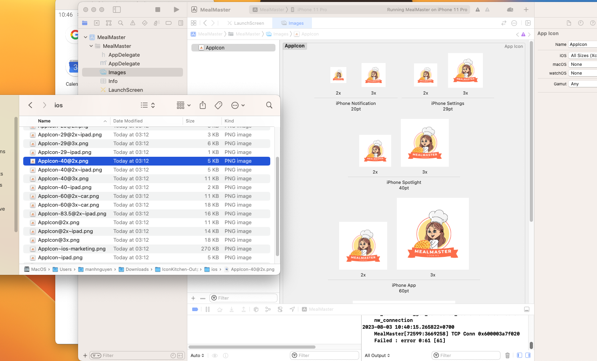

# Setup environment for MAC OS
--updated 2/8/2023--

## Installed Node, Git, Yarn, NPM, Visual Studio.

1. Install **Xcode** : 


    Link: https://apps.apple.com/us/app/xcode/id497799835?mt=12/

2. Install **Homebrew** : Homebrew là chương trình quản lý các package (gói) nó hoạt động trên macOS, Linux. Sử dụng Homebrew giúp bạn dễ dàng cài đặt / gỡ bỏ các gói phần mềm 
- Use this command: **/bin/bash -c "$(curl -fsSL https://raw.githubusercontent.com/Homebrew/install/HEAD/install.sh)"**

  link: https://docs.brew.sh/Installation

3. Install **ANDROID STUDIO**: https://developer.android.com/studio
4. Install **cocoapods**: https://formulae.brew.sh/formula/cocoapods
5. Install **yarn**  with brew: use this command brew install yarn

6. **Setup emulator**: 
    - Android environment: use **android studio**;
        1. **emulator -list-avds**: list máy ảo android
        2. **emulator -avd Pixel_4_API_30**: mở máy ảo


    - Ios environment: use **xcode**;

        1. **touch ~/.bash_profile** : create file;
        2. **open ~/.bash_profile** : open;
        3. Paste this command into this file:
        
        ```js
        export ANDROID_SDK_ROOT=$HOME/Library/Android/sdk
        export PATH=$PATH:$ANDROID_SDK_ROOT/emulator
        export PATH=$PATH:$ANDROID_SDK_ROOT/tools
        export PATH=$PATH:$ANDROID_SDK_ROOT/tools/bin
        export PATH=$PATH:$ANDROID_SDK_ROOT/platform-tools
        export JAVA_HOME=$(/usr/libexec/java_home -v 11.0.16.1)
        export PATH="$PATH:/Applications/Visual Studio Code.app/Contents/Resources/app/bin" 
        ```
        - Lưu ý cài java version 11 nhé;
        -  use this command **cd /Library/Java/JavaVirtualMachines/** gõ ls xem phiên bản bao nhiêu dk-11.0.16.1.jdk


        4. source ~/.bash_profile: save and apply
        

# Setup environment for WINDOW
document: https://reactnative.dev/docs/environment-setup?os=windows&platform=android

1. Cài đặt máy ảo(Có thể dùng android studio hoặc genymotion);
- lưu ý: SetUp SDK cho Android studio như Trên doc

2. Tải SDk. Hiện tại chỉ hỗ trợ Java 11 

3. Cài đặt sdk môi trường cho máy trỏ đến sdk vừa tải:
  - Set up Environment cho `ANDROID_HOME `và `JAVA_HOME`
   - Bỏ trong phần **path** với đường dẫn **C:\Users\admin\AppData\Local\Android\Sdk**

     

4. Cài đặt **react native client**:

   - Với câu lệnh: **npm i -g react-native-cli**

5. Khởi tạo project thôi:

   - Với câu lệnh: **npx react-native init NameProject**
   - Theo phiên bản chỉ định: **npx react-native init AwesomeProject --version X.XX.X**
   - Theo templay TypeScript: **npx react-native init AwesomeTSProject --template react-native-template-typescript**


6. Chạy thử:


--updated 2/8/2023--


# Add Splash screen / App logo for APP 
Follow this guide link: https://youtu.be/_hgsAlPTGXY

## Android Environment:
  ### Add Logo for android: 
  1. Chose a image to make logo for app “png, jpg”;
  2. Go to https://icon.kitchen/ to export file;
  
  3. Get the necessary files for the app, must be have two files about ***ic_launcher.png*** and ***ic_launcher_round.png***;
  ;
    - Lưu ý chỉnh sửa ảnh cho nó phù hợp với kích cỡ của màn hình, remove background;

  4. Rebuild app again to check result;
  ;


## IOS Environment:

  ### Add Logo for android:
  1. init a new project: `npx react-native@latest init AwesomeProject`;
  - Default logo after build new project;
  
  2. Go to https://icon.kitchen/ to export file;
  
  3. Open Xcode to start change logo:
    
  
  4. Move image exported into Xcode: 
  

  5. Rebuild end check results:
    

  