<details>
    <summary><b>Set Up Environment</b></summary>
    
# Setup environment for MAC OS

## Installed Node, Git, Yarn, NPM, Visual Studio.

1. Install **Xcode** :

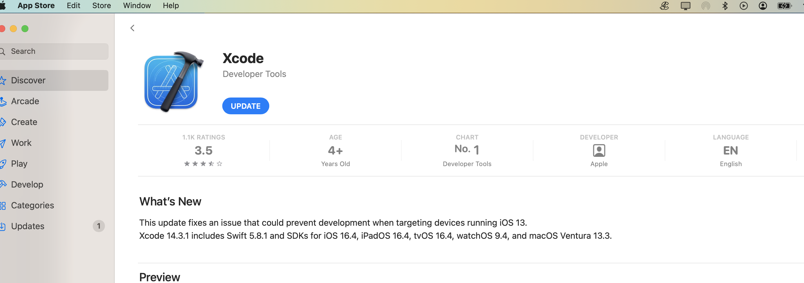

    Link: https://apps.apple.com/us/app/xcode/id497799835?mt=12/

2. Install **Homebrew** : Homebrew là chương trình quản lý các package (gói) nó hoạt động trên macOS, Linux. Sử dụng Homebrew giúp bạn dễ dàng cài đặt / gỡ bỏ các gói phần mềm

- Use this command: **/bin/bash -c "$(curl -fsSL https://raw.githubusercontent.com/Homebrew/install/HEAD/install.sh)"**

  link: https://docs.brew.sh/Installation

3. Install **ANDROID STUDIO**: https://developer.android.com/studio
4. Install **cocoapods**: https://formulae.brew.sh/formula/cocoapods
5. Install **yarn** with brew: use this command brew install yarn

6. **Setup emulator**:

   - Android environment: use **android studio**;

     1. **emulator -list-avds**: list máy ảo android
     2. **emulator -avd Pixel_4_API_30**: mở máy ảo

   - Ios environment: use **xcode**;

     1. **touch ~/.bash_profile** : create file;
     2. **open ~/.bash_profile** : open;
     3. Paste this command into this file:

     ```js
     export ANDROID_SDK_ROOT=$HOME/Library/Android/sdk
     export PATH=$PATH:$ANDROID_SDK_ROOT/emulator
     export PATH=$PATH:$ANDROID_SDK_ROOT/tools
     export PATH=$PATH:$ANDROID_SDK_ROOT/tools/bin
     export PATH=$PATH:$ANDROID_SDK_ROOT/platform-tools
     export JAVA_HOME=$(/usr/libexec/java_home -v 11.0.16.1)
     export PATH="$PATH:/Applications/Visual Studio Code.app/Contents/Resources/app/bin"
     ```

     - Lưu ý cài java version 11 nhé;
     - use this command **cd /Library/Java/JavaVirtualMachines/** gõ ls xem phiên bản bao nhiêu dk-11.0.16.1.jdk

     4. source ~/.bash_profile: save and apply
        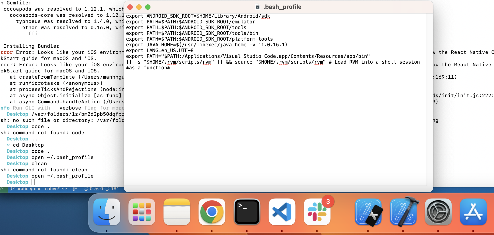

# Setup environment for WINDOW

document: https://reactnative.dev/docs/environment-setup?os=windows&platform=android

1. Cài đặt máy ảo(Có thể dùng android studio hoặc genymotion);

- lưu ý: SetUp SDK cho Android studio như Trên doc

2. Tải SDk. Hiện tại chỉ hỗ trợ Java 11

3. Cài đặt sdk môi trường cho máy trỏ đến sdk vừa tải:

- Set up Environment cho `ANDROID_HOME `và `JAVA_HOME`
- Bỏ trong phần **path** với đường dẫn **C:\Users\admin\AppData\Local\Android\Sdk**

  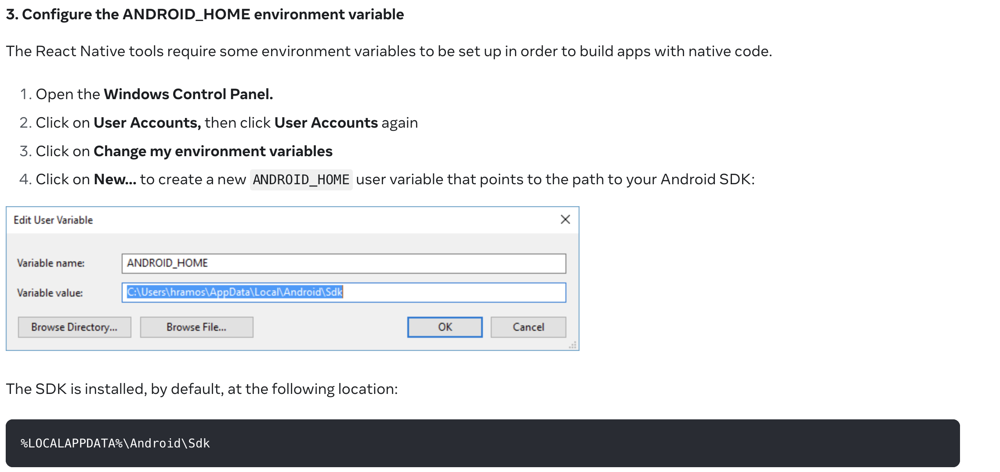

4. Cài đặt **react native client**:

   - Với câu lệnh: **npm i -g react-native-cli**

5. Khởi tạo project thôi:

   - Với câu lệnh: **npx react-native init NameProject**
   - Theo phiên bản chỉ định: **npx react-native init AwesomeProject --version X.XX.X**
   - Theo templay TypeScript: **npx react-native init AwesomeTSProject --template react-native-template-typescript**

6. Chạy thử:
--updated 2/8/2023--
</details>

<details>
    <summary><b>Add Splash screen / App logo for APP</b></summary>

# Add Splash screen / App logo for APP

Follow this guide link: https://youtu.be/_hgsAlPTGXY

<details>
    <summary><b>Android Environment</b></summary>
    
## Android Environment:

### Add Logo for android:

1. Chose a image to make logo for app “png, jpg”;
2. Open your project with android studio;

- Choose Image Asset to open import logo feature;

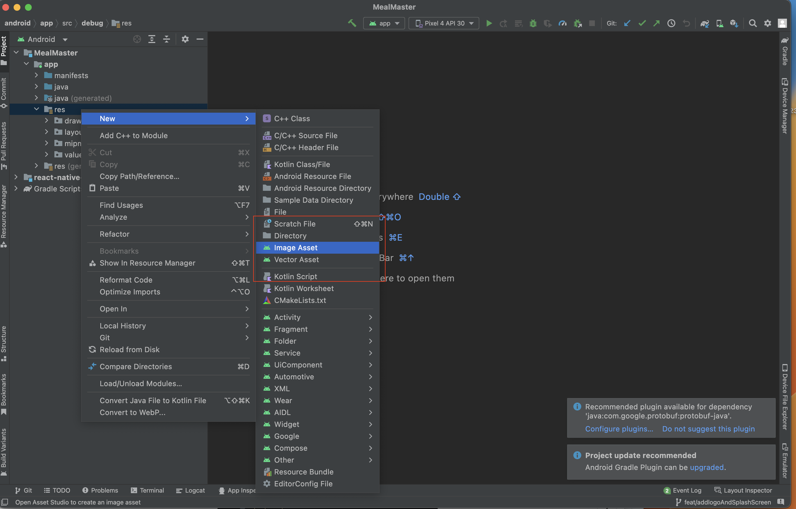

- Import the logo and adjust it to suit the app;
- After editing, click next, android studio will automatically apply the new logo to the app.

  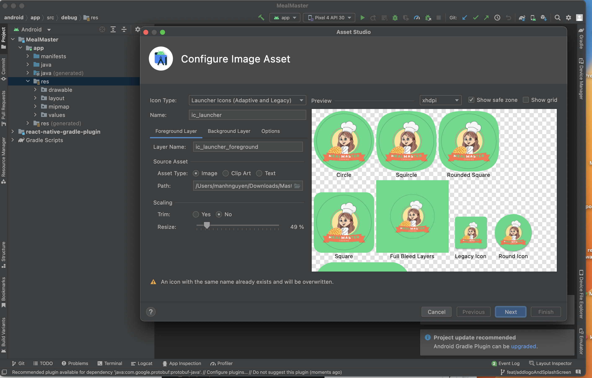
  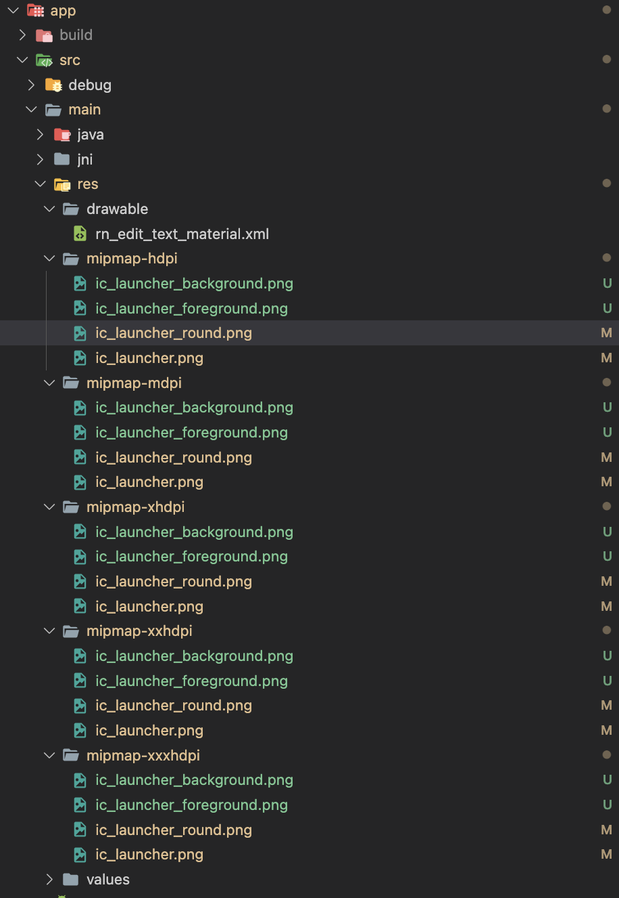;

- Lưu ý chỉnh sửa ảnh cho nó phù hợp với kích cỡ của màn hình, remove background;

4. Rebuild app again to check result;
   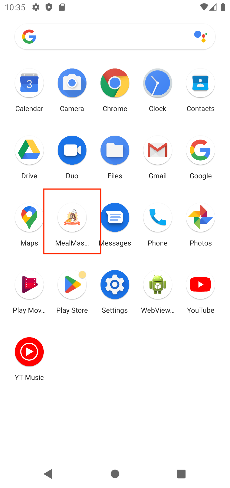;

### Add Splash Screen for android:

#### Custom with native module

1.  Choose a photo to make splash Screen;

- Drag this image logo.png into this folder `android/app/src/main/res/drawable`

  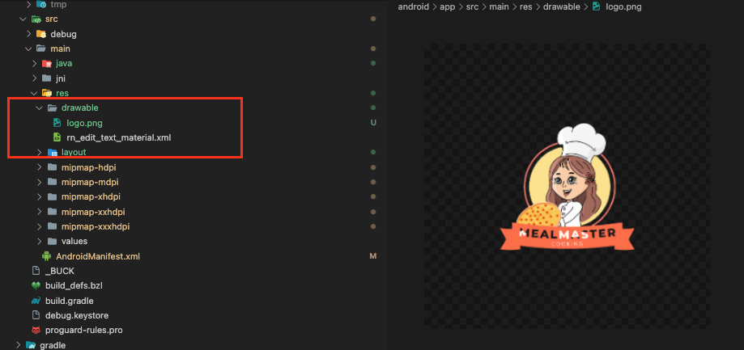

2.  Create `layout` folder, then create `activity_splash.xml` file inside layout folder.

- Edit file `activity_splash.xml` as follows:

```xml
<?xml version="1.0" encoding="utf-8"?>
<LinearLayout xmlns:android="http://schemas.android.com/apk/res/android"
  xmlns:app="http://schemas.android.com/apk/res-auto"
  xmlns:tools="http://schemas.android.com/tools"
  android:layout_width="match_parent"
  android:layout_height="match_parent"
  android:gravity="center"
  tools:context=".SplashActivity">
  <ImageView
      android:layout_width="wrap_content"
      android:layout_height="wrap_content"
      android:background="@drawable/logo" />
      <!-- name of logo -->
</LinearLayout>
```

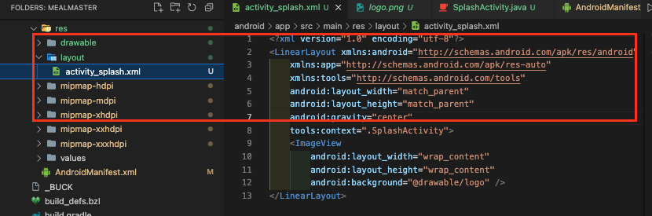

3.  Create SplashActivity.java file inside `android/app/src/main/java/com/mealmaster`

- Edit file `SplashActivity.java` as follows:

```java
package com.mealmaster; // name of app

import androidx.appcompat.app.AppCompatActivity;

import android.content.Intent;
import android.os.Bundle;
import android.os.Handler;

public class SplashActivity extends AppCompatActivity {
    @Override
    protected void onCreate(Bundle savedInstanceState) {
        try {
            super.onCreate(savedInstanceState);
            setContentView(R.layout.activity_splash);
            new Handler().postDelayed(new Runnable() {
                @Override
                public void run() {
                    Intent intent = new Intent(SplashActivity.this, MainActivity.class);
                    Bundle extras = getIntent().getExtras();
                    if (extras != null) {
                        intent.putExtras(extras);
                    }
                    intent.setAction(getIntent().getAction());
                  intent.setData(getIntent().getData());
                    startActivity(intent);
                    finish();
                }
            }, 1500); // set up time display of splash screen
        }
        catch(Exception e) {
            e.printStackTrace();
            finishAffinity();
        }
    }
}
```

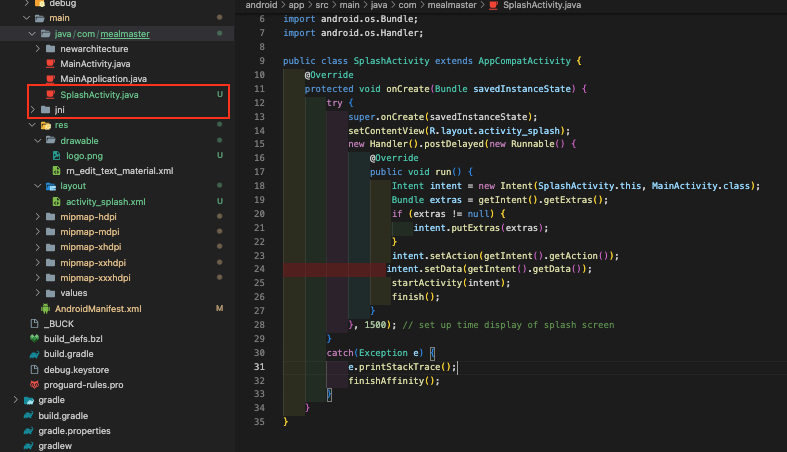

4.  Edit file `AndroidManifest.xml` with path `android/app/src/main/AndroidManifest.xml` as follows:

```xml
 <manifest xmlns:android="http://schemas.android.com/apk/res/android"
   package="com.mealmaster">

     <uses-permission android:name="android.permission.INTERNET" />

     <application
       android:name=".MainApplication"
       android:label="@string/app_name"
       android:icon="@mipmap/ic_launcher"
       android:roundIcon="@mipmap/ic_launcher_round"
       android:allowBackup="false"
       android:theme="@style/AppTheme">

     <activity android:name=".SplashActivity" android:exported="true" android:screenOrientation="portrait">
       <intent-filter>
         <action android:name="android.intent.action.MAIN"/>
         <category android:name="android.intent.category.LAUNCHER"/>
       </intent-filter>
     </activity>

       <activity
         android:name=".MainActivity"
         android:label="@string/app_name"
         android:configChanges="keyboard|keyboardHidden|orientation|screenLayout|screenSize|smallestScreenSize|uiMode"
         android:launchMode="singleTask"
         android:windowSoftInputMode="adjustResize"
         android:exported="true">
     <!-- app activity -->

     <!-- app activity -->
       </activity>

     </application>
 </manifest>
```

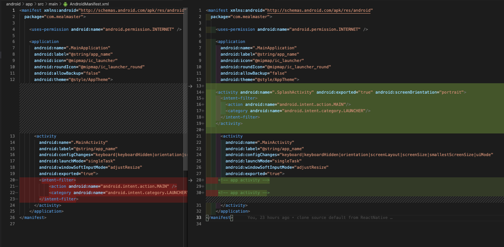

5. Rebuild app and check results;
   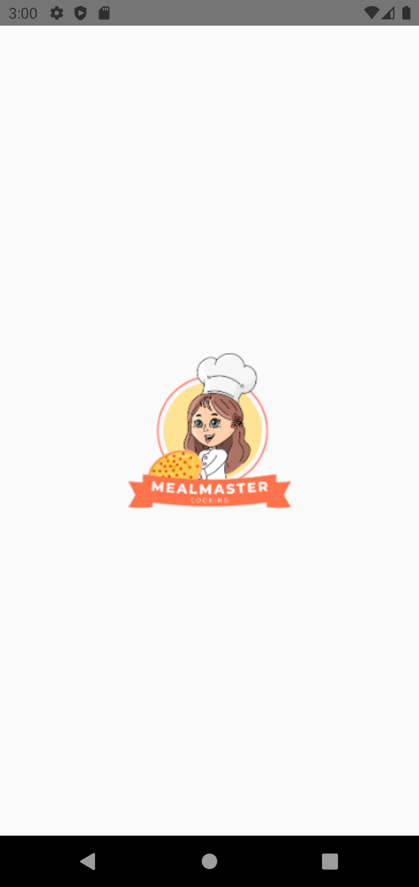

</details>

<details>
    <summary><b>IOS Environment</b></summary>

## IOS Environment:

### Add Logo for IOS:

1. init a new project: `npx react-native@latest init AwesomeProject`;

- Default logo after build new project;
  

2. Open **Asset Catalog Creator** app to start export logo with all type for app:
   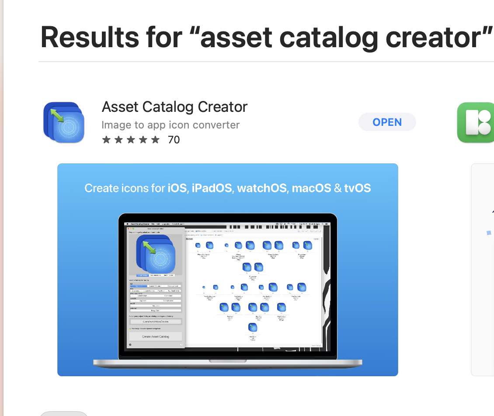
3. Import a logo to export file
   

   - File after exporting:
     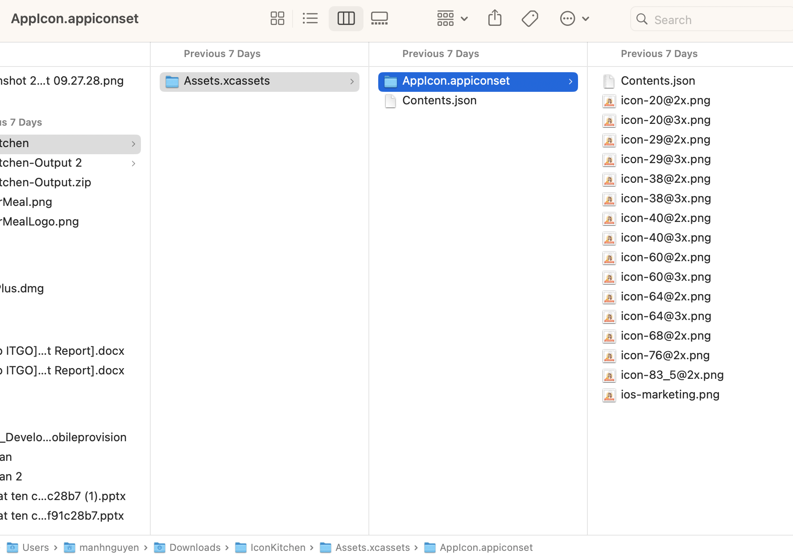

4. Replace folder exported into your project:
   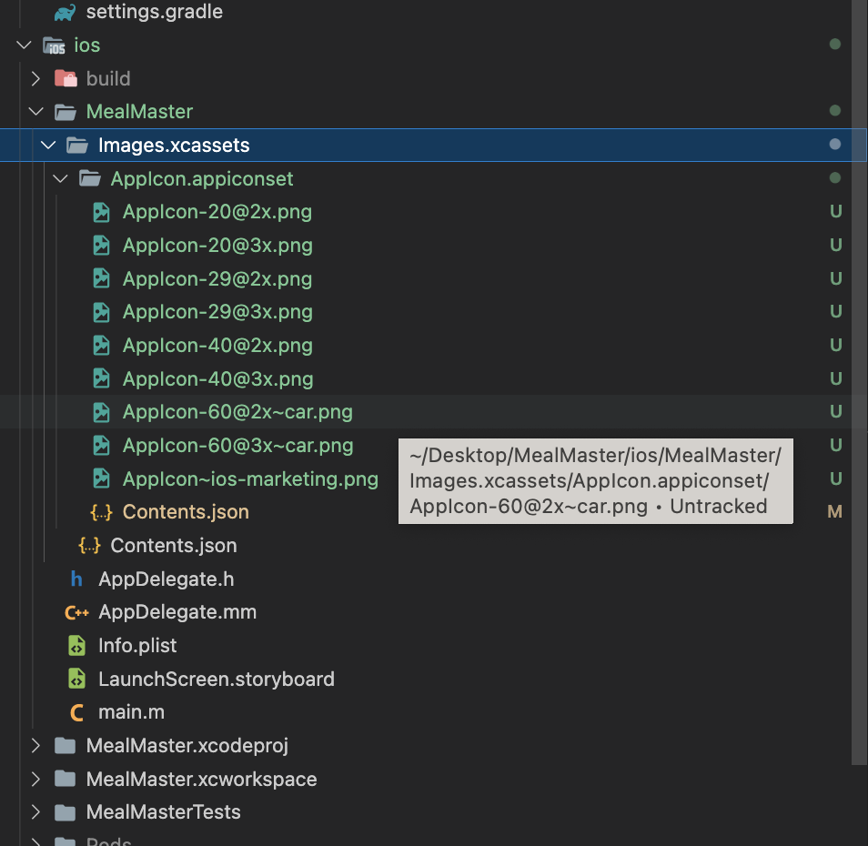

5. Rebuild end check results:
   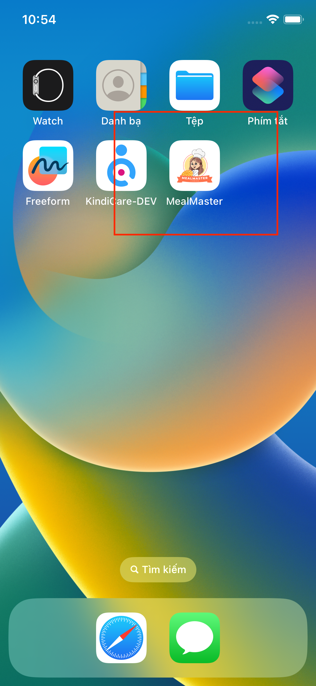

### Add Splash Screen for IOS:

1.  Open Xcode to make splash screen for IOS,

- Default Splash screen

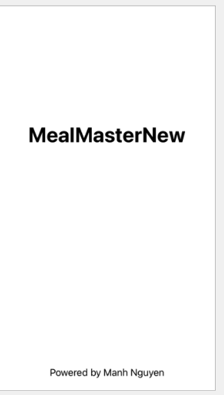

2. Import SplashScreen image;
   

3. Modify LaunchScreen;

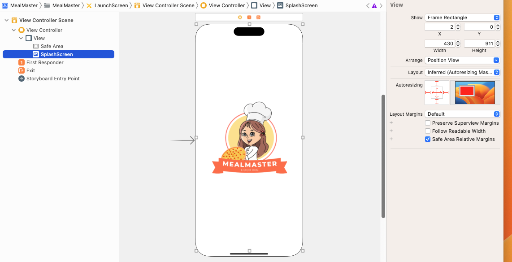

4.  Check again for work on all devices;

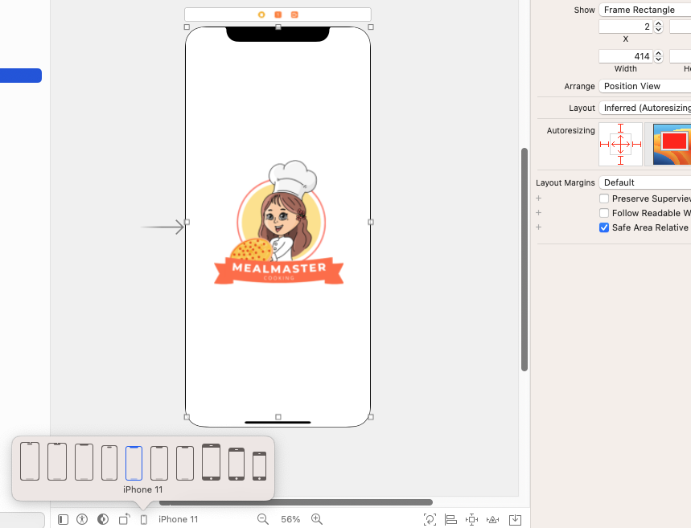

5. Rebuild and check result

--updated 8/8/2023--

</details>
</details>

# Add quickly command;

Modify **package.json** file;

```json

"scripts":{
  ///......
    "android:clean": "cd android && ./gradlew clean",
    "podInstall": "cd ios && pod install && cd ..",
    "podNewClear": "cd ios && rm -rf Pods/* && rm -rf Podfile.lock && cd ..",
    "newclear": "yarn removeCachedFiles && yarn removeCachedMetro && yarn podNewClear && yarn && yarn android:clean && yarn podInstall"

}

```

<details>
    <summary><b>Add eslint and auto format code when save</b></summary>

# Add eslint and auto format code when save;

1. Modified file **MealMaster/.eslintrc.js**

```js
module.exports = {
  root: true,
  extends: '@react-native-community',
  rules: {
    'no-duplicate-imports': 'error',
    'prettier/prettier': [
      'error',
      {
        endOfLine: 'auto',
      },
    ],
    'no-alert': 2,
    'no-console': 2,
    'react-native/no-unused-styles': 2,
    'react-native/no-inline-styles': 2,
    'react-native/no-color-literals': 2,
    'react/no-unused-state': 2,
    'react-hooks/rules-of-hooks': 2,
    'react-hooks/exhaustive-deps': 2,
    'no-unused-vars': 2,
    'sort-imports': [
      'error',
      {
        ignoreDeclarationSort: true,
      },
    ],
  },
};
```

2. Make new folder **.vscode**, and a file in that **settings.json**;

```js
{
  "security.workspace.trust.untrustedFiles": "open",
  "editor.defaultFormatter": "esbenp.prettier-vscode",
  "editor.formatOnSave": true,
  "workbench.iconTheme": "material-icon-theme",
  "javascript.updateImportsOnFileMove.enabled": "always",
  "editor.codeActionsOnSave": {
    "source.organizeImports": true,
    "source.sortMembers": true
  },
  "editor.tabCompletion": "on",
  "window.zoomLevel": -1
}

```

3. Checking results;

</details>

<details>
    <summary><b> Add Vector ICON and Component Paper</b></summary>

# Add Vector ICON and Component Paper;

link: https://www.npmjs.com/package/react-native-vector-icons

1. Add library:

- **yarn add react-native-vector-icons**: add icons [ 'AntDesign.ttf', 'Entypo.ttf', 'EvilIcons.ttf','Feather.ttf', 'FontAwesome.ttf', 'FontAwesome5_Brands.ttf','FontAwesome5_Regular.ttf', 'FontAwesome5_Solid.ttf', 'Fontisto.ttf','Foundation.ttf','Ionicons.ttf','MaterialIcons.ttf', 'MaterialCommunityIcons.ttf', 'SimpleLineIcons.ttf', 'Octicons.ttf', 'Zocial.ttf' ];

- **yarn add react-native-paper** : Thư viện này sẽ một số compent tạo sẵn mình import nhanh vào để dùng

2. Set up IOS;

- Browse to **node_modules/react-native-vector-icons** and drag the folder Fonts to your project in Xcode.
  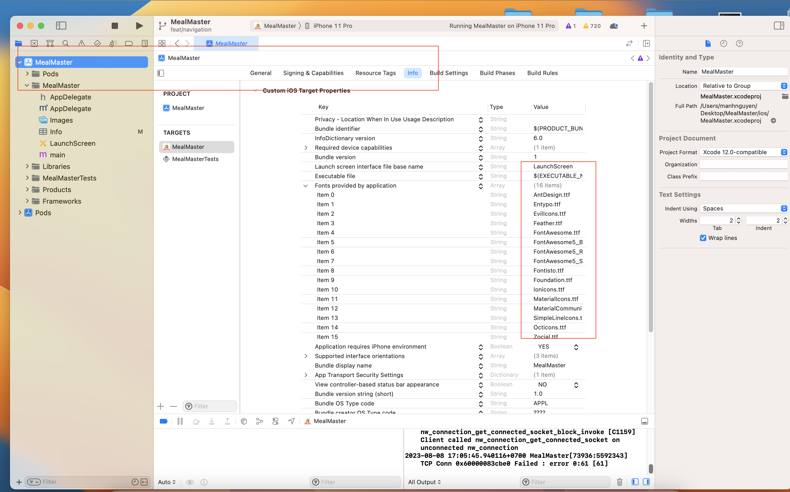
- Or change file

```plist
......
		</dict>
	</dict>
	<key>NSLocationWhenInUseUsageDescription</key>
	<string></string>
  	<!-- fontIcon for IOS -->
	<key>UIAppFonts</key>
	<array>
	  <string>AntDesign.ttf</string>
      <string>Entypo.ttf</string>
      <string>EvilIcons.ttf</string>
      <string>Feather.ttf</string>
      <string>FontAwesome.ttf</string>
      <string>FontAwesome5_Brands.ttf</string>
      <string>FontAwesome5_Regular.ttf</string>
      <string>FontAwesome5_Solid.ttf</string>
      <string>Fontisto.ttf</string>
      <string>Foundation.ttf</string>
      <string>Ionicons.ttf</string>
      <string>MaterialIcons.ttf</string>
      <string>MaterialCommunityIcons.ttf</string>
      <string>SimpleLineIcons.ttf</string>
      <string>Octicons.ttf</string>
      <string>Zocial.ttf</string>
	</array>
  	<!-- fontIcon for IOS -->
	<key>UILaunchStoryboardName</key>
	<string>LaunchScreen</string>
	<key>UIRequiredDeviceCapabilities</key>
	<array>
		<string>armv7</string>
	</array>
  .......
```

3. Setup for Android

- Edit `android/app/build.gradle` ( NOT `android/build.gradle` ) and add the following:

```gradle
apply from: file("../../node_modules/react-native-vector-icons/fonts.gradle")
```

- To customize the files being copied, add the following instead:

```gradle
project.ext.react = [
    enableHermes: true,  // clean and rebuild if changing
]

project.ext.vectoricons = [
    iconFontNames: [ 'AntDesign.ttf', 'Entypo.ttf', 'EvilIcons.ttf','Feather.ttf', 'FontAwesome.ttf', 'FontAwesome5_Brands.ttf','FontAwesome5_Regular.ttf', 'FontAwesome5_Solid.ttf', 'Fontisto.ttf','Foundation.ttf','Ionicons.ttf','MaterialIcons.ttf', 'MaterialCommunityIcons.ttf', 'SimpleLineIcons.ttf', 'Octicons.ttf', 'Zocial.ttf' ] // Name of the font files you want to copy
]

apply from: file("../../node_modules/react-native-vector-icons/fonts.gradle")
apply from: "../../node_modules/react-native/react.gradle"
```

</details>

<details>
    <summary><b> Add Navigation for Project</b></summary>

# Add Navigation for Project;

## Setup

1. Add library :

- **yarn add @react-navigation/native**:
- **yarn add react-native-screens react-native-safe-area-context**
- **yarn add @react-navigation/native-stack**
- **yarn add @react-native-pager-view**

2. Remove old app, and rebuild.

## Demo navigate

<details>
    <summary><b>DEMO</b></summary>

```js
import {NavigationContainer, useNavigation} from '@react-navigation/native';
import {createNativeStackNavigator} from '@react-navigation/native-stack';
import React from 'react';
import {Text, TouchableOpacity, View} from 'react-native';

const Stack = createNativeStackNavigator();

const HomeScreen = () => {
  const {navigate} = useNavigation();
  return (
    <View>
      <Text>HomeScreen</Text>
      <TouchableOpacity
        onPress={() => {
          navigate('Details');
        }}>
        <Text>Navigate</Text>
      </TouchableOpacity>
    </View>
  );
};

const DetailsScreen = () => {
  const {navigate} = useNavigation();
  return (
    <View>
      <Text>DetailsScreen</Text>
      <TouchableOpacity
        onPress={() => {
          navigate('Favorite');
        }}>
        <Text>Navigate</Text>
      </TouchableOpacity>
    </View>
  );
};

const FavoriteScreen = () => {
  const {popToTop} = useNavigation(); // navigate to the initialRouteName
  return (
    <View>
      <Text>FavoriteScreen</Text>
      <TouchableOpacity onPress={popToTop}>
        <Text>Navigate</Text>
      </TouchableOpacity>
    </View>
  );
};

const App = () => {
  return (
    <NavigationContainer>
      <Stack.Navigator initialRouteName="Home">
        <Stack.Screen name="Home" component={HomeScreen} />
        <Stack.Screen name="Details" component={DetailsScreen} />
        <Stack.Screen name="Favorite" component={FavoriteScreen} />
      </Stack.Navigator>
    </NavigationContainer>
  );
};

export default App;

// const styles = StyleSheet.create({});
```

</details>

## Bottom Tab Navigator

link: https://reactnavigation.org/docs/bottom-tab-navigator

1. Add library :

### Use are made sure installed all library here

- **yarn add @react-navigation/bottom-tabs react-native-paper react-native-vector-icons** :
- **yarn add @react-navigation/native**:
- **yarn add react-native-screens react-native-safe-area-context**
- **yarn add @react-navigation/native-stack**
- **yarn add @react-native-pager-view**

<details>
    <summary><b>DEMO</b></summary>

```js
import {NavigationContainer, useNavigation} from '@react-navigation/native';
import React from 'react';
import {Image, ScrollView, Text, TouchableOpacity} from 'react-native';
import {
  Avatar,
  Banner,
  Button,
  Card,
  IconButton,
  Searchbar,
  Tooltip,
} from 'react-native-paper';

import Icon from 'react-native-vector-icons/FontAwesome5';

import {createBottomTabNavigator} from '@react-navigation/bottom-tabs';
import {SafeAreaView} from 'react-native-safe-area-context';

import MaterialCommunityIcons from 'react-native-vector-icons/MaterialCommunityIcons';

const Tab = createBottomTabNavigator();

// const Stack = createNativeStackNavigator();

const HomeScreen = () => {
  const {navigate} = useNavigation();
  const [visible, setVisible] = React.useState(true);
  const [searchQuery, setSearchQuery] = React.useState('');

  const onChangeSearch = query => setSearchQuery(query);

  const LeftContent = props => <Avatar.Icon {...props} icon="folder" />;
  return (
    <SafeAreaView style={{flex: 1}}>
      <ScrollView>
        <Searchbar
          placeholder="Search"
          onChangeText={onChangeSearch}
          value={searchQuery}
        />
        <Text>HomeScreen</Text>
        <Avatar.Icon size={24} icon="folder" color="yellow" />
        <Icon name="rocket" size={30} color="#900" solid />
        <Button
          onPress={() => {
            navigate('Details');
          }}>
          <Text>Navigate</Text>
        </Button>

        <Banner
          visible={visible}
          actions={[
            {
              label: 'Fix it',
              onPress: () => setVisible(false),
            },
            {
              label: 'Learn more',
              onPress: () => setVisible(false),
            },
          ]}
          icon={({size}) => (
            <Image
              source={{
                uri: 'https://avatars3.githubusercontent.com/u/17571969?s=400&v=4',
              }}
              style={{
                width: size,
                height: size,
              }}
            />
          )}>
          There was a problem processing a transaction on your credit card.
        </Banner>

        <Card>
          <Card.Title
            title="Card Title"
            subtitle="Card Subtitle"
            left={LeftContent}
          />
          <Card.Content>
            <Text variant="titleLarge">Card title</Text>
            <Text variant="bodyMedium">Card content</Text>
          </Card.Content>
          <Card.Cover source={{uri: 'https://picsum.photos/700'}} />
          <Card.Actions>
            <Button>Cancel</Button>
            <Button>Ok</Button>
          </Card.Actions>
        </Card>

        <Tooltip title="Selected Camera">
          <IconButton icon="camera" selected size={24} onPress={() => {}} />
        </Tooltip>

        <Icon.Button name="facebook" onPress={this.loginWithFacebook} solid>
          Login with Facebook
        </Icon.Button>
      </ScrollView>
    </SafeAreaView>
  );
};

const DetailsScreen = () => {
  const {navigate} = useNavigation();
  return (
    <SafeAreaView>
      <Text>DetailsScreen</Text>
      <TouchableOpacity
        onPress={() => {
          navigate('Favorite');
        }}>
        <Text>Navigate</Text>
      </TouchableOpacity>
    </SafeAreaView>
  );
};

const ProfileScreen = () => {
  const {popToTop} = useNavigation();
  return (
    <SafeAreaView>
      <Text>FavoriteScreen</Text>
      <TouchableOpacity onPress={popToTop}>
        <Text>Navigate</Text>
      </TouchableOpacity>
    </SafeAreaView>
  );
};

const App = () => {
  return (
    <NavigationContainer>
      <Tab.Navigator
        initialRouteName="Home"
        activeColor="#e91e63"
        barStyle={{backgroundColor: 'white'}}>
        <Tab.Screen
          name="Home"
          component={HomeScreen}
          options={{
            tabBarLabel: 'Home',
            tabBarIcon: ({color}) => (
              <MaterialCommunityIcons name="home" color={color} size={26} />
            ),
          }}
        />
        <Tab.Screen
          name="Details"
          component={DetailsScreen}
          options={{
            tabBarLabel: 'Updates',
            tabBarIcon: ({color}) => (
              <MaterialCommunityIcons name="bell" color={color} size={26} />
            ),
          }}
        />
        <Tab.Screen
          name="ProfileScreen"
          component={ProfileScreen}
          options={{
            tabBarLabel: 'Profile',
            tabBarIcon: ({color}) => (
              <MaterialCommunityIcons name="account" color={color} size={26} />
            ),
          }}
        />
      </Tab.Navigator>
    </NavigationContainer>
  );
};

export default App;

// const styles = StyleSheet.create({});
```

</details>

</details>

<details>
    <summary><b>Add Multi Language</b></summary>

# Add Multi Language;

1. Install these libraries:

```js
  yarn add i18next
  yarn add react-i18next
  yarn add @react-native-async-storage/async-storage
```

2. Create a folder contains your translation as below:

```js
// Create a folder contains your locales like this:
├── locales
│   ├── en ├── strings.json
│   ├── vi ├── strings.json
│   └── index.js

// Example in en/strings.json
	{
	  "onboarding": {
	    "hello": "Hello"
	  },
  }
// Example in vi/strings.json
	{
	  "onboarding": {
	    "hello": "Xin chào"
	  },
  }

// Update code in index.js
export default {
  vi: {
    translation: require('./vi/strings.json'),
  },
  en: {
    translation: require('./en/strings.json'),
  },
};

// create a file name initI18n.js to configure how it translates
import AsyncStorage from '@react-native-async-storage/async-storage';
import i18n from 'i18next';
import {initReactI18next} from 'react-i18next';
import { Platform, NativeModules } from 'react-native';
import locales from '../locales'; // path to your locales folder

const LANGUAGE_KEY = '@language';
const DEFAULT_LANGUAGE = 'vi'; // you can define it here

const getDeviceLanguage = () => {
  const appLanguage =
    Platform.OS === 'ios'
      ? NativeModules.SettingsManager.settings.AppleLocale ||
        NativeModules.SettingsManager.settings.AppleLanguages[0]
      : NativeModules.I18nManager.localeIdentifier;

  return appLanguage.search(/-|_/g) !== -1
    ? appLanguage.slice(0, 2)
    : appLanguage;
};

const languageDetector = {
  init: () => {},
  type: 'languageDetector',
  async: true, // flags below detection to be async
  detect: async (callback) => {
    const userLang = await AsyncStorage.getItem(LANGUAGE_KEY);

    const deviceLang = userLang || getDeviceLanguage() || DEFAULT_LANGUAGE;
    callback(deviceLang);
  },
  cacheUserLanguage: () => {},
};

export const initI18n = () => {
  i18n
		.use(languageDetector)
		.use(initReactI18next)
		.init({
      compatibilityJSON: 'v3',
      fallbackLng: DEFAULT_LANGUAGE,
      debug: __DEV__, // set to log debug on terminal
      resources: locales,
      interpolation: {
        escapeValue: false,
      },
      react: {useSuspense: false},
    });
};


// use initI18n() function in index.js (root project)
initI18n();

// use translate in jsx
import {useTranslation} from 'react-i18next';
import {View, Button, Text} from 'react-native';

const Home = () => {
	 const [language, setLanguage] = React.useState('en');

  const {t} = useTranslation();

  const updateLanguage = async selectedLanguage => {
    if (selectedLanguage) {
      // update key in async storage
      // await storeData(STORAGE_KEY.LANGUAGE, selectedLanguage);
      setLanguage(language === 'vi' ? 'en' : 'vi');
      i18next.changeLanguage(language);
      // handle any other handlers here
      // Navigation.mergeOptions
    }
  };

	return (
		<View>
			<Text>{t('onboarding.hello')}</Text>
			<Button title='Change Language' onPress={onUpdateLanguage} />
		</View>
	)
}

```

</details>

<details>
    <summary><b>Setup Redux to mange state</b></summary>

# Setup Redux to mange state

1. Install these libraries:

```js
  yarn add @reduxjs/toolkit
  yarn add react-redux
  yarn add redux-persist
  yarn add redux-thunk
```

2. Create files and folders as follow;

- `AppRedux` quản lý app và `AuthRedux` quản lý user

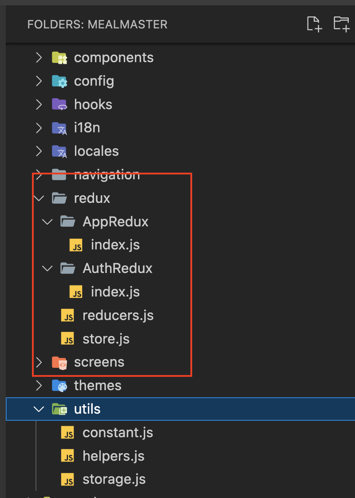

3. Modify these file with follow

```js
///AppRedux/index.js

import {createSlice} from '@reduxjs/toolkit';

const initialState = {
  language: 'en',
};
const appSlice = createSlice({
  name: 'app',
  initialState,
  reducers: {
    setLanguage: (state, action) => action.payload,
    setDefault: () => initialState,
  },
});

export const {setLanguage, setDefault} = appSlice.actions;
export default appSlice.reducer;


//AuthRedux/index.js

import {createSlice} from '@reduxjs/toolkit';
const authSlice = createSlice({
  name: 'auth',
  initialState: {
    name: 'Nguyen Hung Manh',
  },
  reducers: {
    setUser: (state, action) => action.payload,
    clearUser: () => null,
  },
});

export const {setUser, clearUser} = authSlice.actions;
export default authSlice.reducer;

//redux/reducers.js

import {combineReducers} from '@reduxjs/toolkit';
import appReducer from './AppRedux';
import authReducer from './AuthRedux';

const rootReducer = combineReducers({
  app: appReducer,
  auth: authReducer,
});

export default rootReducer;


//redux/store.js
import AsyncStorage from '@react-native-async-storage/async-storage';
import {combineReducers, configureStore} from '@reduxjs/toolkit';
import {persistReducer, persistStore} from 'redux-persist';
import thunk from 'redux-thunk';
import appReducer from './AppRedux';
import authReducer from './AuthRedux';

const persistConfig = {
  key: 'root',
  storage: AsyncStorage,
  whitelist: ['app', 'auth'], // lưu lại trạng thái
  blacklist: [], // khong luu trang thái
};

const reducers = combineReducers({
  app: appReducer,
  auth: authReducer,
});

const persistedReducer = persistReducer(persistConfig, reducers);

export const store = configureStore({
  reducer: persistedReducer,
  devTools: true,
  middleware: [thunk],// fix waring register
});
export const persistor = persistStore(store);

```

4. Modify `App.js` file, integrate the Redux store and Redux Persist provider:

```js
import {
  NavigationContainer,
  createNavigationContainerRef,
} from '@react-navigation/native';
import React from 'react';
import {Provider} from 'react-redux';
import {PersistGate} from 'redux-persist/integration/react';
import {initI18n} from './src/i18n';
import {MainNavigator} from './src/navigation/stack';
import {persistor, store} from './src/redux/store';
initI18n(); //import multiLanguage

const navigationRef = createNavigationContainerRef();

const AppWrapper = () => {
  return <MainNavigator isAbleToGoHome={true} isAuthenticated={true} />;
};

const App = () => {
  return (
    <NavigationContainer ref={navigationRef}>
      <Provider store={store}>
        <PersistGate loading={true} persistor={persistor}>
          <AppWrapper />
        </PersistGate>
      </Provider>
    </NavigationContainer>
  );
};

export default App;

// const styles = StyleSheet.create({});
```

5. Use redux to show and set new sate

```js
import React from 'react';
import {SafeAreaView, Text, TouchableOpacity} from 'react-native';
import {useDispatch, useSelector} from 'react-redux';
import {setLanguage} from '../../redux/AppRedux'; // function set State

const ProfileScreen = () => {
  const user = useSelector(state => state.auth);
  const app = useSelector(state => state.app);

  const dispatch = useDispatch();

  const changeTheme = () => {
    dispatch(setLanguage({language: 'vi'}));
  };

  return (
    <SafeAreaView>
      <Text>
        ProfileScreen{user?.name} {app.language}
      </Text>
      <TouchableOpacity onPress={changeTheme}>
        <Text>Change Language: {app.language}</Text>
      </TouchableOpacity>
    </SafeAreaView>
  );
};

export default ProfileScreen;

// const styles = StyleSheet.create({});
```

</details>

<details>
    <summary><b>Setup Zustand to mange state</b></summary>

# Setup Zustand to mange state

1. Install Zustand;

```
  yarn add zustand
  yarn add react-native-async-storage/async-storage
```

2. Create file and folder for Zustand

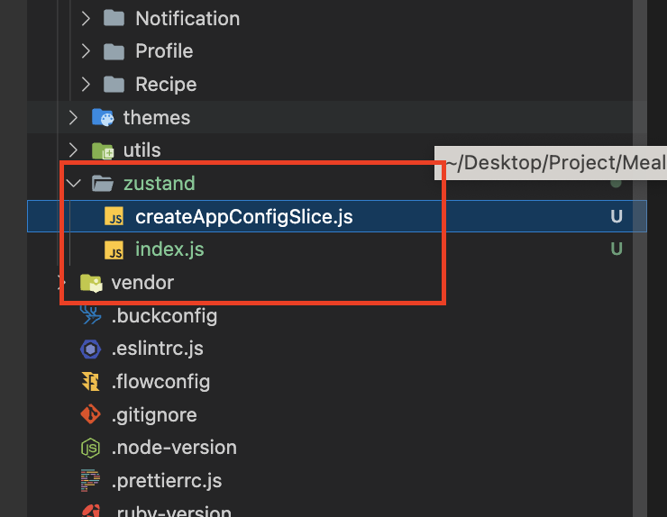

3.  Modify these file with follow

```js
//zustand/createAppConfigSlice.js
export const createAppConfigSlice = (set, get) => ({
  number: 0,
  counterNumber: newNumber => set({number: newNumber}), // keywords cannot be duplicated
});

///zustand/index.js

import AsyncStorage from '@react-native-async-storage/async-storage';
import {createJSONStorage, persist} from 'zustand/middleware';
import {createWithEqualityFn} from 'zustand/traditional';
import {createAppConfigSlice} from './createAppConfigSlice';

export const useStore = createWithEqualityFn(
  persist(
    (set, get) => ({
      ...createAppConfigSlice(set, get),
    }),
    {
      name: 'app-storage',
      storage: createJSONStorage(() => AsyncStorage),
    },
  ),
);
```

4. Use Zustands to show and set new sate

```js
import React from 'react';
import {SafeAreaView, Text, TouchableOpacity} from 'react-native';
import {shallow} from 'zustand/shallow';
import {useStore} from '../../zustand';

const FavoriteScreen = () => {
  const {number, counterNumber} = useStore(
    state => ({
      number: state.number,
      counterNumber: state.counterNumber,
    }),
    shallow,
  );

  const increaseNumber = () => {
    counterNumber(number + 1);
  };
  return (
    <SafeAreaView>
      <Text>FavoriteScree{number}</Text>
      <TouchableOpacity onPress={increaseNumber}>
        <Text>Count</Text>
      </TouchableOpacity>
    </SafeAreaView>
  );
};

export default FavoriteScreen;
```

</details>

<details>
    <summary><b>Login with Facebook</b></summary>

1. `sed "s/your_api_key_here/your_actual_api_key/g" .env.example > .env`: Send .env.example file to env

# Quickly Login with Facebook

## Prepare Environments

1. Add Libraries

```
yarn add react-native-fbsdk-next  (10.1.0)

```

2. Go to `https://developers.facebook.com/` to create your own facebook app by following these steps below:

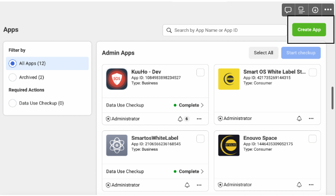

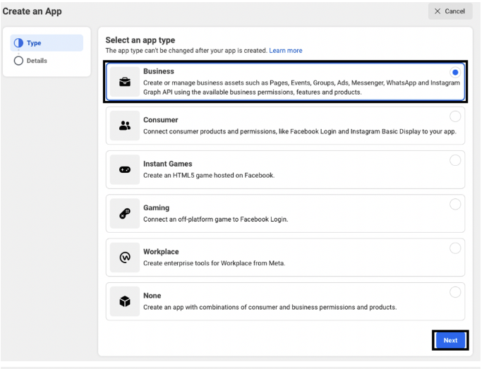

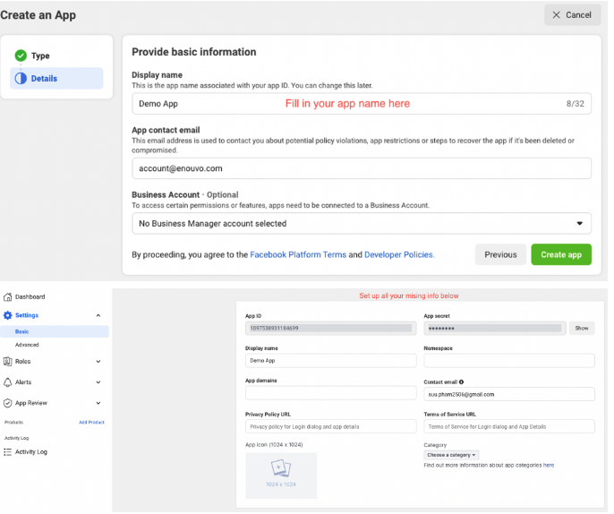

- Go to Products/Add Product and and choose Facebook Login product.

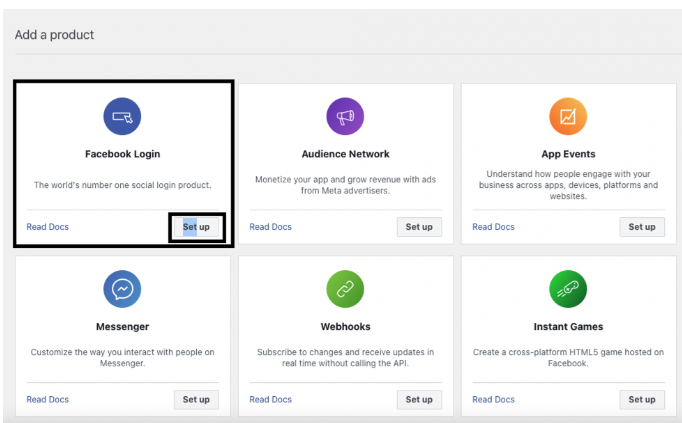

- We will set up for both platform here (Android & IOS)

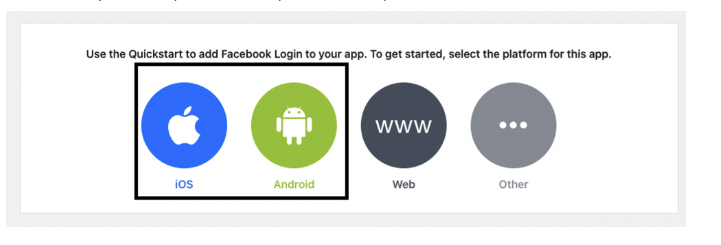

## IOS Environments

1. Add Bundle ID


2. Modify `ios/MealMaster/Info.plist` to add key `FacebookAppID`, `FacebookClientToken` and `FacebookDisplayName`

```javascript
<string>1.0</string>
	<key>CFBundleSignature</key>
	<string>????</string>

	<key>FacebookAppID</key>
    <string>145287721907504</string>
	 <key>FacebookClientToken</key>
  	<string>e51f17b6c394f7ac0bffba8bc93e2944</string>
    <key>FacebookDisplayName</key>
    <string>mastermeal</string>
	<key>CFBundleURLTypes</key>
	<array>
		<dict>
			<key>CFBundleTypeRole</key>
			<string>Editor</string>
			<key>CFBundleURLSchemes</key>
			<array>
				<string>fb145287721907504</string>
			</array>
		</dict>
	</array>
	<key>CFBundleVersion</key>
	<string>1</string>
	<key>LSRequiresIPhoneOS</key>
```

3. Modify `ios/MealMaster/AppDelegate.mm`

```mm
#import <React/RCTAppSetupUtils.h>

#import <FBSDKCoreKit/FBSDKCoreKit.h>  // here

#if RCT_NEW_ARCH_ENABLED
#import <React/CoreModulesPlugins.h>
#import <React/RCTCxxBridgeDelegate.h>
	@@ -31,9 +33,12 @@ @implementation AppDelegate

- (BOOL)application:(UIApplication *)application didFinishLaunchingWithOptions:(NSDictionary *)launchOptions
{
  [[FBSDKApplicationDelegate sharedInstance] initializeSDK]; // here
  RCTAppSetupPrepareApp(application);

  RCTBridge *bridge = [[RCTBridge alloc] initWithDelegate:self launchOptions:launchOptions];
  [[FBSDKApplicationDelegate sharedInstance] application:application
                        didFinishLaunchingWithOptions:launchOptions];// here

#if RCT_NEW_ARCH_ENABLED
  _contextContainer = std::make_shared<facebook::react::ContextContainer const>();

```

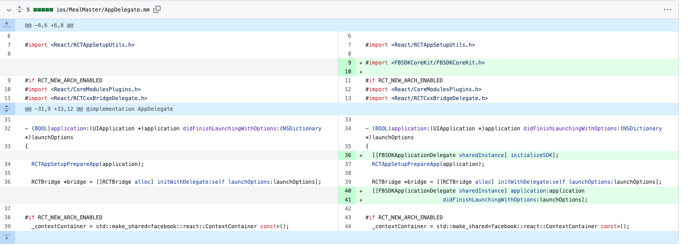

5. Use in project `useAuthentication`

```js
import {AccessToken, LoginManager, Profile} from 'react-native-fbsdk-next';
import {useDispatch} from 'react-redux';
import {setUser} from '../redux/AuthRedux';

const useAuthentication = () => {
  const dispatch = useDispatch();
  //social handlers
  const loginFacebook = async () => {
    console.log('vao day');
    try {
      LoginManager.logOut();

      const result = await LoginManager.logInWithPermissions([
        'public_profile',
        'email',
      ]);
      if (result) {
        if (result.isCancelled) {
        } else {
          const tokenResponse = await AccessToken.getCurrentAccessToken();
          if (tokenResponse) {
            Profile.getCurrentProfile().then(function (currentProfile) {
              dispatch(
                setUser({
                  firstName: currentProfile.firstName,
                  facebookId: currentProfile.userID,
                  lastName: currentProfile.lastName,
                  avatar: currentProfile.imageURL,
                  email: currentProfile.email,
                }),
              );
            });
          }
        }
      }
    } catch (error) {}
  };
  return {
    loginFacebook,
  };
};

export {useAuthentication};
```

6. Rebuild and check again

## Android Environments

1. Modify `android/app/build.gradle`

```js
    implementation "com.facebook.react:react-native:+"  // From node_modules


    implementation 'com.facebook.android:facebook-android-sdk:latest.release' //here

    implementation "androidx.swiperefreshlayout:swiperefreshlayout:1.0.0"

    debugImplementation("com.facebook.flipper:flipper:${FLIPPER_VERSION}") {
```

2. `android/app/src/main/res/values/strings.xml`

```js
<resources>
  <string name="app_name">MealMaster</string>{' '}
  <string name="app_name">MealMaster</string>
  <string name="facebook_app_id">14528772190xxxx</string>
  <string name="facebook_client_token">e51f17b6c394f7ac0bffba8bc9XXXXX</string>
</resources>
```

3. Modify `android/app/src/main/AndroidManifest.xml`

```js
      android:allowBackup="false"
      android:theme="@style/AppTheme">

    <!-- sign in with facebook -->
    <meta-data android:name="com.facebook.sdk.ApplicationId" android:value="@string/facebook_app_id"/>
    <meta-data android:name="com.facebook.sdk.ClientToken" android:value="@string/facebook_client_token"/>
    <!-- sign in with facebook -->

    <activity android:name=".SplashActivity" android:exported="true" android:screenOrientation="portrait">
      <intent-filter>
        <action android:name="android.intent.action.MAIN"/>
```

</details>

<details>
    <summary><b>Login With Google</b></summary>

# Login With Google

1. Install the library

```
yarn add @react-native-google-signin/google-signin (latest version: 8.0.0)

```

2. Go to https://console.firebase.google.com/ to create your own firebase app by following these steps below:

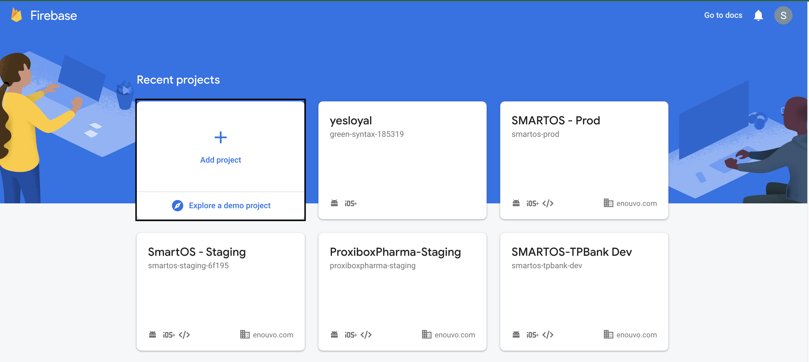

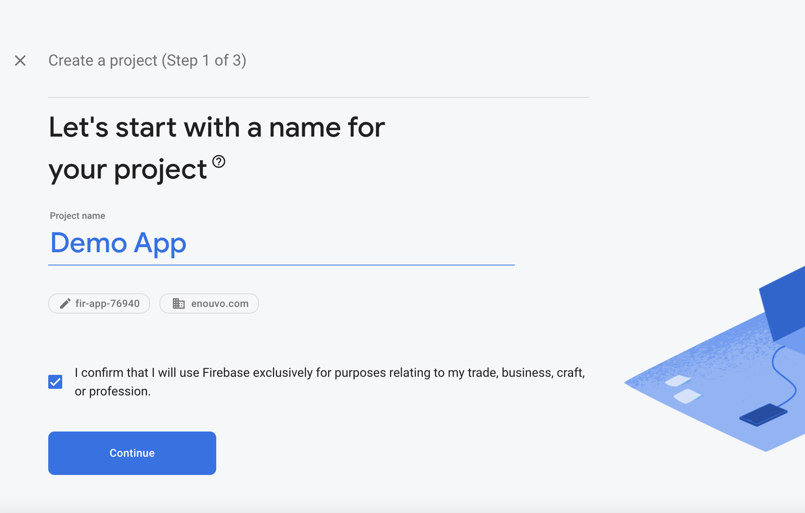

- After creating project successfully, we will see this:

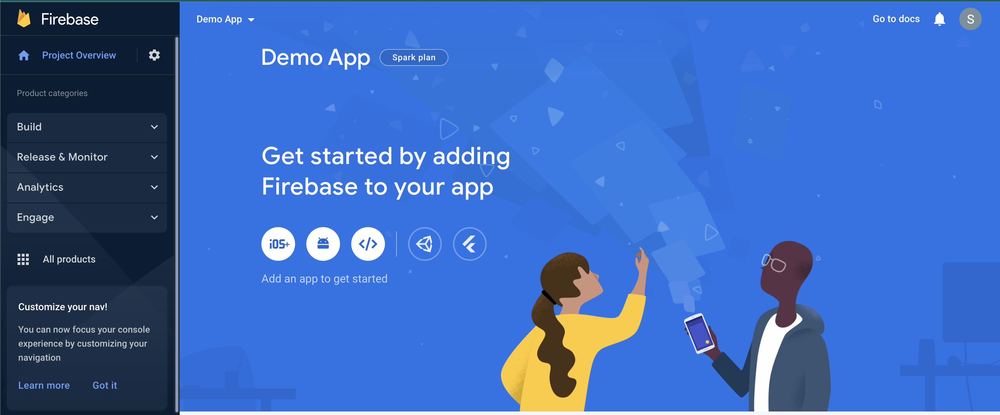

- Anble here:

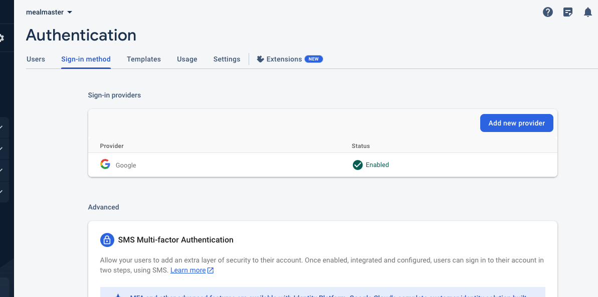

- Let's configure for 2 specific platforms: (IOS & Android)

## IOS Environment

1. Fill in bundle id and app name and download `GoogleService-Info.plist`


2. Drag your `GoogleService-Info.plist` to `MealMaster/ios/MealMaster` root folder. Please select your scheme and check copy if needed

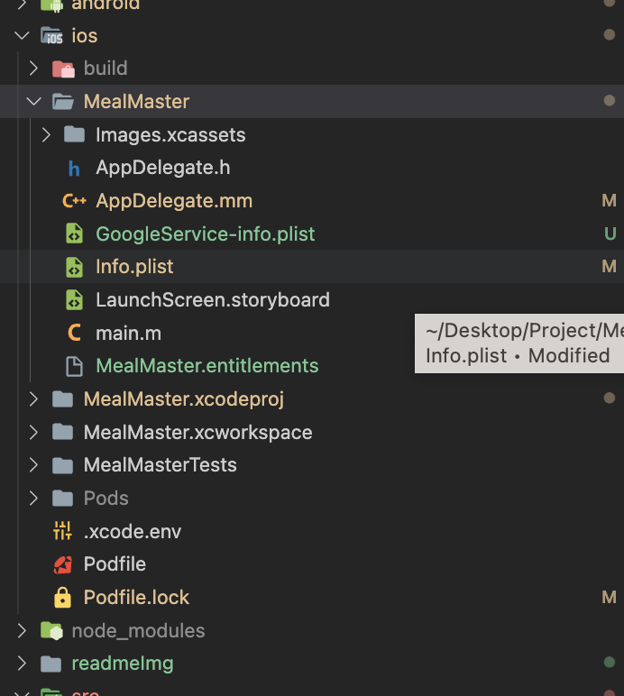

3. Modify file `MealMaster/ios/MealMaster/Info.plist`

```plist
// GOOGLE_REVERSED_CLIENT_ID is found at <key>REVERSED_CLIENT_ID</key>
// in your GoogleService-Info.plist

GOOGLE_REVERSED_CLIENT_ID=com.googleusercontent.apps.523123115560-8nf3cpu7ltdod5l4dlq5sepsks500hhe

<key>CFBundleURLTypes</key>
	<array>
		...
			<key>CFBundleTypeRole</key>
			<string>Editor</string>
			<key>CFBundleURLSchemes</key>
			<array>
				<string>$(GOOGLE_REVERSED_CLIENT_ID)</string>
			</array>
		</dict>
	</array>

```

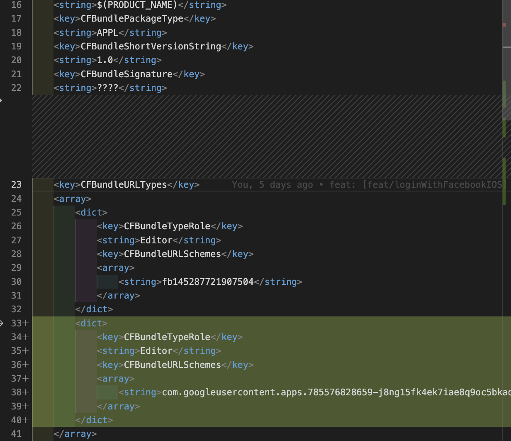

4. Modify file `MealMaster/ios/MealMaster/AppDelegate.mm`

```mm

#import <RNGoogleSignin/RNGoogleSignin.h>

......

- (BOOL)application:(UIApplication *)application
            openURL:(NSURL *)url
            options:(NSDictionary<UIApplicationOpenURLOptionsKey,id> *)options {

  ...

  [RNGoogleSignin application:application openURL:url options:options];

  return YES;
}

```

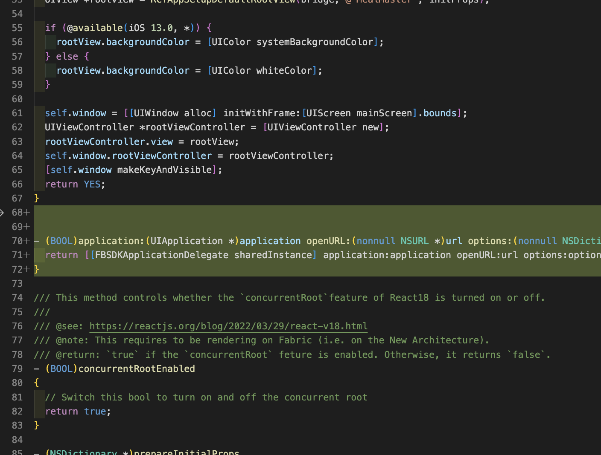

## Android Environomemt

1. Fill in bundle id in(`MealMaster/android/app/src/main/AndroidManifest.xml`), app name, SHA-1 (required for google sign in) and download `google-services.json` file.

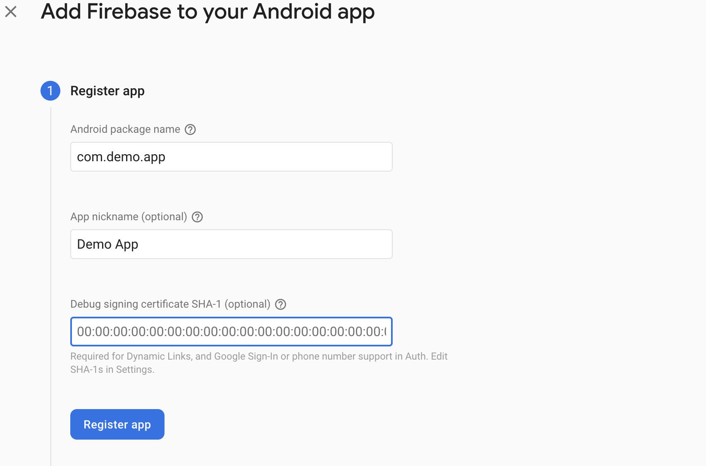

2. Drag your `google-services.json` to `MealMaster/android/app/google-services.json` root folder.

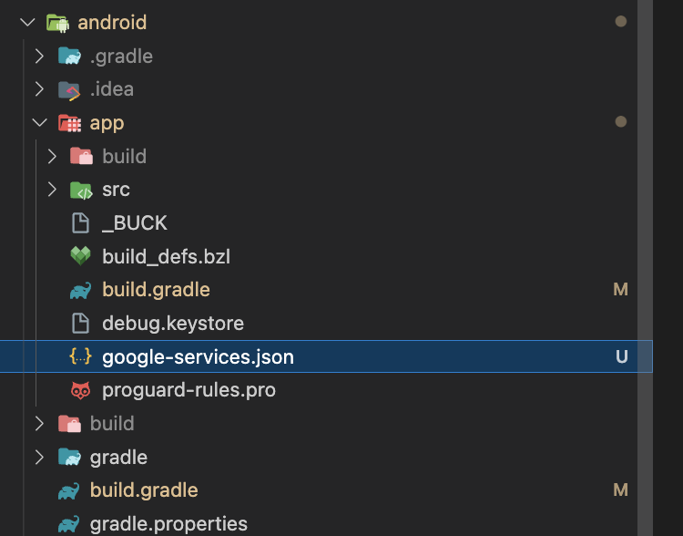

3. Add SHA-1 fingerprint

- To get the SHA1:

  - From your project root, `cd android && ./gradlew signingReport`.
  - Scroll to the top of output, see the fingerprints. Debug fingerprint is used in dev, release fingerprint is used in production.

- To add the SHA1:
  - Sign in to Firebase and open your project.
  - Click the Settings icon and select Project settings.
  - In the Your apps card, select the package name of the app you need a to add SHA1 to.
  - Click "Add fingerprint".
    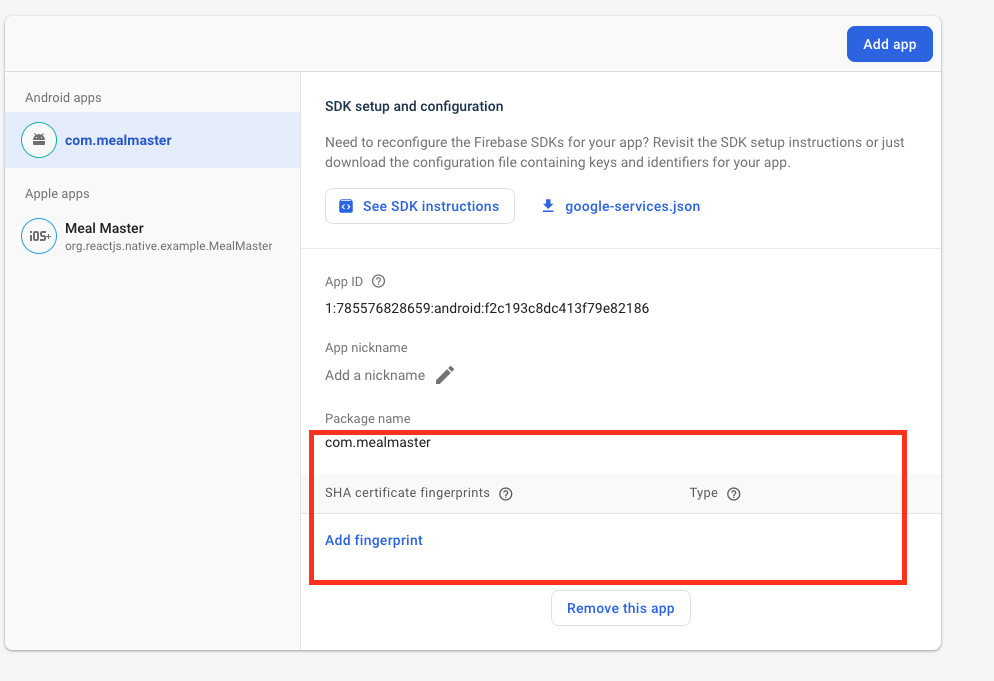

4. Re-download the `google-services.json` file and put it into your project at `android/app` if you modify SHA1

5. Modify `android/build.gradle`

```gradle
buildscript {
    ext {
        buildToolsVersion = "27.0.3"
        minSdkVersion = 16
        compileSdkVersion = 27
        targetSdkVersion = 26
        supportLibVersion = "27.1.1"
        googlePlayServicesAuthVersion = "19.2.0" // <--- use this version or newer
    }
...
    dependencies {
        classpath 'com.android.tools.build:gradle:4.2.1' // <--- use this version or newer
        classpath 'com.google.gms:google-services:4.3.10' // <--- use this version or newer
    }
...
allprojects {
    repositories {
        mavenLocal()
        google() // <--- make sure this is included
        jcenter()
        maven {
            // All of React Native (JS, Obj-C sources, Android binaries) is installed from npm
            url "$rootDir/../node_modules/react-native/android"
        }
    }
}
```

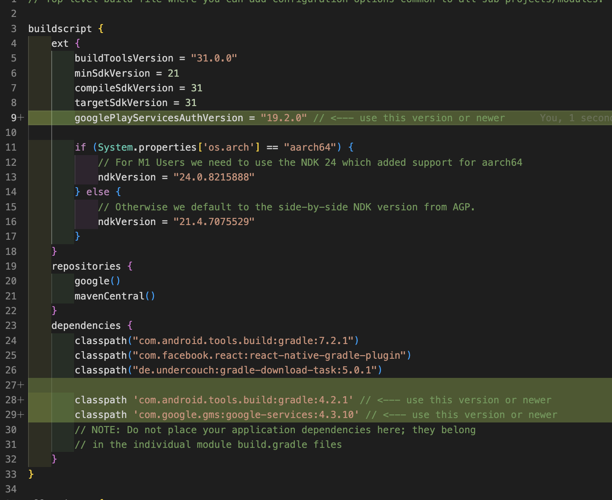

6. Modify `android/app/build.gradle`

```gradle
apply plugin: "com.android.application"
apply plugin: 'com.google.gms.google-services' // <--- this should be the last line

dependencies {
    implementation fileTree(dir: "libs", include: ["*.jar"])
    implementation "com.facebook.react:react-native:+"
    implementation 'androidx.swiperefreshlayout:swiperefreshlayout:1.0.0' // <-- add this; newer versions should work too
}


```

## Use in JS code

```js
import {
  GoogleSignin,
  statusCodes,
} from '@react-native-google-signin/google-signin';
import {useEffect} from 'react';
import {useDispatch} from 'react-redux';
import {setUser} from '../redux/AuthRedux';
import {IS_ANDROID} from '../utils/constants';

const useAuthentication = () => {
  const dispatch = useDispatch();

  useEffect(() => {
    GoogleSignin.configure({
      webClientId: IS_ANDROID
        ? 'client_id_type_3' // android/app/google-services.json
        : 'REVERSED_CLIENT_ID', // ios/MealMaster/GoogleService-info.plist
      iosClientId: 'REVERSED_CLIENT_ID', // ios/MealMaster/GoogleService-info.plist
      offlineAccess: true,
      forceCodeForRefreshToken: true,
      //profileImageSize: 150,
    });
  }, []);

  const loginGoogle = async () => {
    try {
      GoogleSignin.revokeAccess();
      GoogleSignin.signOut();
      await GoogleSignin.hasPlayServices();
      const googleUserInfo = await GoogleSignin.signIn();

      if (googleUserInfo) {
        dispatch(
          setUser({
            firstName: googleUserInfo?.user.name,
            googleId: googleUserInfo?.user.id,
            avatar: googleUserInfo?.user?.photo,
            email: googleUserInfo.user?.email,
          }),
        );
      }
    } catch (error) {
      switch (error.code) {
        case statusCodes.SIGN_IN_CANCELLED:
          break;
        case statusCodes.IN_PROGRESS:
          break;
        case statusCodes.PLAY_SERVICES_NOT_AVAILABLE:
          break;
        case statusCodes.SIGN_IN_REQUIRED:
          break;
        default:
          break;
      }
    }
  };

  return {
    loginGoogle,
  };
};

export {useAuthentication};
```

</details>

<details>
    <summary><b>Login with Apple</b></summary>

# Login with Apple

1. Install the library: yarn add @invertase/react-native-apple-authentication (latest version: 2.2.2)

2. Add Capability “Sign in with Apple” to ios project by clicking Signing and capabilities to show the below noted view. Click + Capability and from the menu select Sign in with Apple which will appear at the bottom as highlighted.

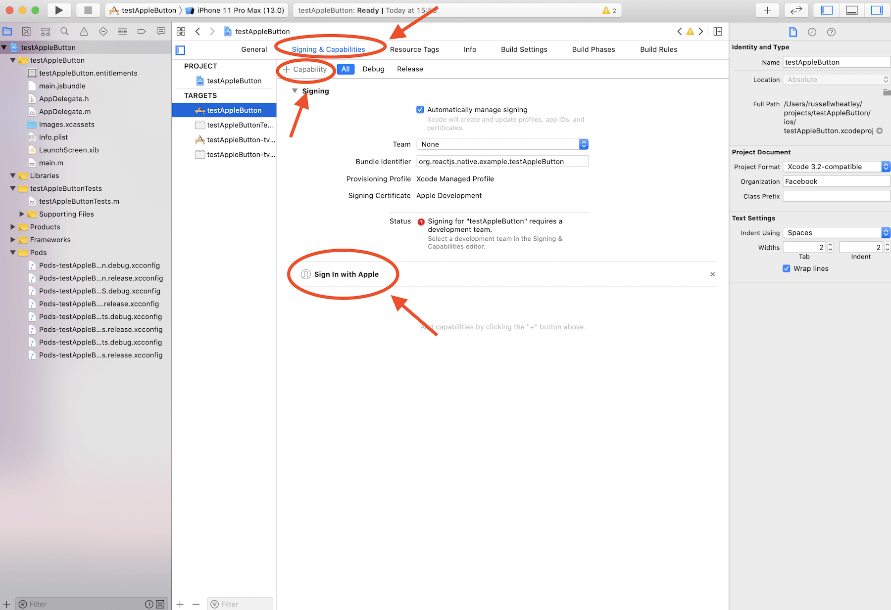

- If your Identifiers not including Sign in with Apple, do following steps:

  - Go to Apple Console, then select Certificates, IDs & profiles
    

  - Click on `Identifiers` in the left-hand sidebar. Click on your project in the list
    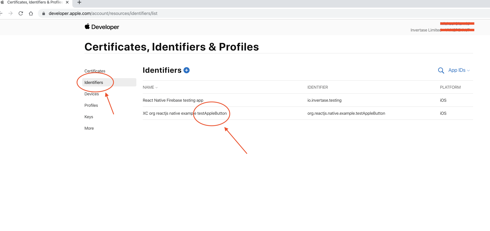

  - Tick the checkbox for `Sign in with Apple` and click the `Edit` button. Select `Enable as a primary App ID` and click `Save` button
    

  - Click the `Save` button at the top of the screen.
    

3. Use react-native-apple-authentication in JS code

```js
import appleAuth from '@invertase/react-native-apple-authentication';

const loginApple = async () => {
  try {
    const appleAuthRequestResponse = await appleAuth.performRequest({
      requestedOperation: appleAuth.Operation.LOGIN,
      requestedScopes: [appleAuth.Scope.EMAIL, appleAuth.Scope.FULL_NAME],
    });
    if (!appleAuthRequestResponse.identityToken) {
    } else {
      const {identityToken} = appleAuthRequestResponse;
      if (identityToken) {
        // use identityToken to handle with BE side
      }
    }
  } catch (error) {
    if (error?.code === appleAuth.Error.CANCELED) {
      return;
    }
    //show error
  }
};
```

</details>

<details>
    <summary><b>Use react-query to call api</b></summary>

# Use react-query to call api

1. Install library

```js
  yarn add @tanstack/react-query
  yarn add axios
  yarn add react-native-device-info // use to get app header (helper file)

```

2. Import into `App.js` root file;

```js
import {
  NavigationContainer,
  createNavigationContainerRef,
} from '@react-navigation/native';
import React from 'react';
import {StatusBar} from 'react-native';
import {Provider, useSelector} from 'react-redux';
import {initI18n} from './src/i18n';
import {MainNavigator} from './src/navigation/stack';
import {persistor, store} from './src/redux/store';
initI18n(); //import multiLanguage

import {MD3LightTheme, PaperProvider} from 'react-native-paper';
import {APP_COLORS} from './src/themes/colors';
const navigationRef = createNavigationContainerRef();

import {QueryClient, QueryClientProvider} from '@tanstack/react-query';

const AppWrapper = () => {
  const userInfo = useSelector(state => state.auth.userInfo);

  return <MainNavigator isAbleToGoHome={userInfo} />;
};

const App = () => {
  const queryClient = new QueryClient({
    defaultOptions: {
      queries: {
        retry: 3,
        staleTime: 60 * 1000,
      },
    },
  });
  return (
    <NavigationContainer ref={navigationRef}>
      <QueryClientProvider client={queryClient}>
        <AppWrapper />
        <StatusBar />
      </QueryClientProvider>
    </NavigationContainer>
  );
};

export default App;
```

3. Make new `src/api` forder and create 2 files `appApi.js` to define api and `auth.js` to call api for authentication funtion

   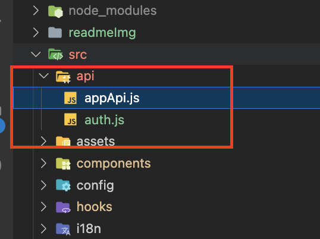

```js
//../src/api/appApi.js

import axios from 'axios';
import Config from 'react-native-config';
import {API_TIMEOUT} from '../utils/constants';
import {STORAGE_KEYS, getString} from '../utils/storage';
import DeviceInfo from 'react-native-device-info';

const getAppHeaders = async () => {
  return {
    'x-os': Platform.OS,
    'x-version': `${DeviceInfo.getVersion()}(${DeviceInfo.getBuildNumber()})`,
    'x-bundle-id': DeviceInfo.getBundleId(),
    'x-device-id': await DeviceInfo.getUniqueId(),
    'time-zone': new Intl.DateTimeFormat().resolvedOptions().timeZone,
    'Content-Type': 'application/json',
  };
};

const appApi = axios.create({
  baseURL: Config.BASE_URL_API,
  timeout: API_TIMEOUT,
});

console.log(Config.BASE_URL_API);

appApi.interceptors.request.use(async config => {
  const token = await getString(STORAGE_KEYS.TOKEN);
  const defaultHeaders = await getAppHeaders();
  config.headers = {
    ...defaultHeaders,
  };

  config.headers.Authorization = `Bearer ${token}`;

  return config;
});

appApi.interceptors.response.use(
  response => {
    return response?.data || response;
  },
  async error => {
    const {
      config,
      response: {status},
    } = error;

    showSystemAlert({
      message: JSON.stringify(error?.message),
    });

    return Promise.reject(error.response?.data);
  },
);

export const commonQueryDetailFunction = async ({queryKey = []}) => {
  const {url, params = {}} = queryKey[0];
  if (!url) {
    return null;
  }

  return appApi.get(url, {params});
};

export default appApi;

//../src/api/auth.js

//example

import appApi from './appApi';

const AUTHENTICATION_ENDPOINTS = Object.freeze({
  LOGIN: '/api/auth/login',
  REGISTER: '/api/auth/register',
  VERIFY: '/api/auth/verify',
  REQUEST_CODE_VERIFY_EMAIL: '/api/auth/requestCodeVerifyEmail',
  RESET_PASSWORD: '/api/auth/reset-password',
});

const loginByEmailApi = async data => {
  // email, password
  return appApi.post(AUTHENTICATION_ENDPOINTS.LOGIN, data);
};

const registerAccountApi = async data => {
  // firstName, lastName, email, password
  return appApi.post(AUTHENTICATION_ENDPOINTS.REGISTER, data);
};

const verifyEmailApi = async data => {
  //  email, emailVerificationCode
  return appApi.post(AUTHENTICATION_ENDPOINTS.VERIFY, data);
};

const requestCodeVerifyEmailApi = async data => {
  //  email,
  return appApi.post(AUTHENTICATION_ENDPOINTS.REQUEST_CODE_VERIFY_EMAIL, data);
};

const resetPasswordApi = async data => {
  //  email, password, confirmPassword
  return appApi.post(AUTHENTICATION_ENDPOINTS.RESET_PASSWORD, data);
};

export {
  loginByEmailApi,
  registerAccountApi,
  requestCodeVerifyEmailApi,
  resetPasswordApi,
  verifyEmailApi,
};
```

4. Call api in `hooks/useAuthentication.js`

```js
import {useEffect} from 'react';

import {useNavigation} from '@react-navigation/native';
import {useMutation} from '@tanstack/react-query';
import {useDispatch} from 'react-redux';
import {
  loginByEmailApi,
  registerAccountApi,
  requestCodeVerifyEmailApi,
  resetPasswordApi,
  verifyEmailApi,
} from '../api/auth';
import {setUser} from '../redux/AuthRedux';
import {IS_ANDROID} from '../utils/constants';
import {showSystemAlert} from '../utils/helpers';

const useAuthentication = () => {
  const dispatch = useDispatch();
  const {navigate} = useNavigation();

  const {mutateAsync: registerAccount, isLoading: registerAccountLoading} =
    useMutation(registerAccountApi, {
      onSuccess: ({email}) => {
        navigate('VerifyAccount', {email});
      },
      onError: error => {
        showSystemAlert({
          message: JSON.stringify(error.errors[0].message),
        });
      },
    });

  const {mutateAsync: verifyEmail, isLoading: verifyEmailLoading} = useMutation(
    verifyEmailApi,
    {
      onSuccess: ({data}) => {
        if (data?.isFromForgotPassword) {
          navigate('ResetPassword', {email: data?.user?.email});
        } else {
          navigate('Login', {email: data?.user?.email});
        }
      },
      onError: error => {
        showSystemAlert({
          message: JSON.stringify(error.errors[0].message),
        });
      },
    },
  );

  const {mutateAsync: loginByEmail, isLoading: loginByEmailLoading} =
    useMutation(loginByEmailApi, {
      onSuccess: res => {
        dispatch(setUser(res?.user));
      },
      onError: (error, {email}) => {
        if (error?.messageCode === 'UNVERIFIED_EMAIL') {
          navigate('VerifyAccount', {
            email,
          });
          return;
        }
        showSystemAlert({
          message: JSON.stringify(error.errors[0].message),
        });
      },
    });

  const {
    mutateAsync: requestCodeVerifyEmail,
    isLoading: requestCodeVerifyEmailLoading,
  } = useMutation(requestCodeVerifyEmailApi, {
    onSuccess: res => {
      navigate('VerifyAccount', {
        email: res?.email,
        isFromForgotPassword: true,
      });
    },
    onError: error => {
      showSystemAlert({
        message: JSON.stringify(error.errors[0].message),
      });
    },
  });

  const {mutateAsync: resetPassword, isLoading: resetPasswordLoading} =
    useMutation(resetPasswordApi, {
      onSuccess: ({data}) => {
        navigate('Login', {email: data?.user?.email});
      },
      onError: error => {
        showSystemAlert({
          message: JSON.stringify(error.errors[0].message),
        });
      },
    });

  return {
    loginByEmail,
    registerAccount,
    verifyEmail,
    requestCodeVerifyEmail,
    resetPassword,
    verifyEmailLoading,
    registerAccountLoading,
    loginByEmailLoading,
    requestCodeVerifyEmailLoading,
    resetPasswordLoading,
  };
};

export {useAuthentication};
```

5. Demo for login funtion

```js
const Login = () => {
  const {navigate} = useNavigation();
  const {t} = useTranslation();
  const route = useRoute();
  const {email} = route.params || {};

  const {loginByEmail, loginByEmailLoading} = useAuthentication();

  const formik = useFormik({
    initialValues: {
      email: email || 'manh.nguyen22@student.passerellesnumeriques.org',
      password: '123456',
    },
    validationSchema: Yup.object({
      email: Yup.string()
        .email(t('validation.emailInvalid'))
        .required(t('validation.emailIsRequire')),
      password: Yup.string()
        .min(6, t('validation.password6-20'))
        .max(20, t('validation.password6-20'))
        .required(t('validation.passwordIsRequire')),
    }),
    onSubmit: values => {
      loginByEmail({...values, tokenDevice: 'demo-token'});
    },
  });
  return (
    <SafeAreaContainer loading={loginByEmailLoading}>
      <KeyboardContainer>
        <Input
          required
          keyboardType="email-address"
          style={styles.input}
          onChangeText={formik.handleChange('email')}
          onBlur={formik.handleBlur('email')}
          error={formik.errors.email}
          defaultValue={formik.values.email}
          label={t('authentication.emailAddress')}
          placeholder={t('authentication.yourEmailAddress')}
          returnKeyType="next"
        />
        <Input
          required
          style={styles.input}
          onChangeText={formik.handleChange('password')}
          onBlur={formik.handleBlur('password')}
          error={formik.errors.password}
          defaultValue={formik.values.password}
          label={t('authentication.password')}
          placeholder={t('authentication.password')}
          secureTextEntry
        />
        <Button
          label={t('authentication.login')}
          style={styles.button}
          onPress={formik.handleSubmit}
        />
      </KeyboardContainer>
    </SafeAreaContainer>
  );
};

export default Login;
```

</details>

<details>
    <summary><b>Take Photo and Pick Image from library</b></summary>

# Take Photo and Pick Image from library

1. Add library;

```

yarn add react-native-permissions
yarn add react-native-image-crop-picker
yarn add react-native-document-picker
yarn add react-native-dialogs

```

2. Make **useMediaPicker** to mange picker

```js
//../hooks/useMediaPicker.js

import i18next from 'i18next';
import ImagePicker from 'react-native-image-crop-picker';
import {RESULTS, openSettings, request} from 'react-native-permissions';
import {uploadFileApi} from '../api/upload';
import {
  CAMERA_PERMISSION_STRING,
  DEFAULT_PICKER_OPTION,
  PHOTO_PERMISSION_STRING,
  PICKER_METHOD,
} from '../utils/constants';
import {
  getMaxSize,
  roundByteToMB,
  showMenuOptions,
  showSystemAlert,
} from '../utils/helpers';

const requestPermission = async (error, method) => {
  try {
    const response = await request(
      method === PICKER_METHOD.CAMERA
        ? CAMERA_PERMISSION_STRING
        : PHOTO_PERMISSION_STRING,
    );
    if (
      [RESULTS.BLOCKED, RESULTS.UNAVAILABLE, RESULTS.DENIED].includes(response)
    ) {
      return showSystemAlert({
        message: error?.message,
        actions: [
          {text: 'cancel', onPress: () => {}},
          {
            text: 'ok',
            onPress: openSettings,
          },
        ],
      });
    }
  } catch (errors) {}
};

const getImageFromPicker = async (options = {}) => {
  try {
    const response = await ImagePicker.openPicker({
      ...DEFAULT_PICKER_OPTION,
      ...options,
      smartAlbums: ['UserLibrary', 'Favorites'],
      compressVideoPreset: 'Passthrough',
    });
    return response;
  } catch (error) {
    getErrorFromPicker(error);
  }
};

const getImageFromCamera = async () => {
  try {
    const response = await ImagePicker.openCamera(DEFAULT_PICKER_OPTION);
    return response;
  } catch (error) {
    getErrorFromCamera(error);
  }
};

const getErrorFromPicker = error => {
  switch (error?.code) {
    case 'E_NO_LIBRARY_PERMISSION':
      requestPermission(error, PICKER_METHOD.PHOTO);
      break;
    case 'E_PICKER_CANCELLED':
      break;
    default:
      showSystemAlert({
        message: error?.message,
      });
      break;
  }
};

const getErrorFromCamera = async error => {
  await requestPermission(error, PICKER_METHOD.CAMERA);
  switch (error.code) {
    case 'E_NO_CAMERA_PERMISSION':
      requestPermission(error, PICKER_METHOD.CAMERA);
      break;
    default:
      showSystemAlert({
        message: error?.message,
      });
      break;
  }
};

export const validateBeforeUploading = ({
  uploadFn,
  pickerResponse,
  validateEnabled = false,
  customAlert,
}) => {
  if (!pickerResponse) {
    return;
  }
  if (validateEnabled) {
    if (
      roundByteToMB(pickerResponse.size) >= getMaxSize(pickerResponse).maxSize
    ) {
      if (customAlert) {
        customAlert(getMaxSize(pickerResponse).errorMessage);
        return;
      } else {
        return showSystemAlert({
          message: i18next.t(getMaxSize(pickerResponse).errorMessage),
        });
      }
    }

    uploadFn?.(pickerResponse);
    return;
  }
  uploadFn?.(pickerResponse);
};

const useMediaPicker = (resultCallback = () => {}) => {
  const pickImage = async (options = {}) => {
    try {
      const response = await getImageFromPicker(options);
      validateBeforeUploading({
        options,
        validateEnabled: options?.validateEnabled,
        customAlert: options?.customAlert,
        pickerResponse: response,
        uploadFn: async () => {
          // Dùng formData mới có thể pick file được
          const formData = new FormData();
          formData.append('image', {
            uri: response?.path,
            name: response?.path,
            type: response.mime,
          });
          //  handle upload
          const result = await uploadFileApi(formData);
          resultCallback?.(result);
          return result;
        },
      });
    } catch (error) {
      getErrorFromPicker(error);
    }
  };

  const openCamera = async (options = {}) => {
    try {
      const response = await getImageFromCamera();

      validateBeforeUploading({
        pickerResponse: response,
        validateEnabled: options?.validateEnabled,
        uploadFn: async () => {
          // Dùng formData mới có thể pick file được
          const formData = new FormData();
          formData.append('image', {
            uri: response?.path,
            name: response?.path,
            type: response.mime,
          });
          //  handle upload
          const result = await uploadFileApi(formData);
          resultCallback?.(result);
          return result;
        },
      });
    } catch (error) {
      getErrorFromCamera(error);
    }
  };

  const showImagePickerOptions = (options = {}) => {
    const PICKER_OPTIONS = [
      {id: 1, label: 'Take a Photo'},
      {id: 2, label: 'Choose From Library'},
    ];

    return showMenuOptions({
      data: {
        items: PICKER_OPTIONS,
        title: 'Select your option',
        selectedId: 0,
      },
      onSelectItem: index => {
        switch (index) {
          case 0:
            openCamera(options);
            break;
          case 1:
            pickImage(options);
            break;
          default:
            break;
        }
      },
    });
  };

  return {
    pickImage,
    openCamera,
    showImagePickerOptions,
  };
};

export {useMediaPicker};
```

3. Some contanst and helper funtion to import

```js
//src/utils/constants.js

const CAMERA_PERMISSION_STRING = Platform.select({
  ios: PERMISSIONS.IOS.CAMERA,
  android: PERMISSIONS.ANDROID.CAMERA,
});

const PHOTO_PERMISSION_STRING = Platform.select({
  ios: PERMISSIONS.IOS.PHOTO_LIBRARY,
  android: PERMISSIONS.ANDROID.READ_EXTERNAL_STORAGE,
});

const PICKER_METHOD = {
  CAMERA: 'camera',
  PHOTO: 'photo',
  VIDEO: [DocumentPicker.types.video],
  DOCUMENT: [
    DocumentPicker.types.pdf,
    DocumentPicker.types.docx,
    DocumentPicker.types.pptx,
    DocumentPicker.types.doc,
    DocumentPicker.types.ppt,
  ],
};

const DEFAULT_PICKER_OPTION = {
  forceJpg: true,
  cropping: false,
  compressImageQuality: Platform.select({
    ios: 0.8,
    android: 1,
  }),
};

//src/utils/heplers.js

import i18next from 'i18next';
import {ActionSheetIOS} from 'react-native';
import DeviceInfo from 'react-native-device-info';
import DialogAndroid from 'react-native-dialogs/DialogAndroid';
import {IS_IOS} from './constants';

//PICK DOCUMENT start

const showMenuOptions = ({
  data,
  onSelectItem,
  labelKey = 'label',
  idKey = 'id',
  useTranslate = false,
}) => {
  const {title, items, selectedId, cancelLabel} = data;
  if (IS_IOS) {
    const cancelLabelIOS = cancelLabel || i18next.t('buttons.cancel');

    const labels = items?.map(e =>
      useTranslate ? i18next.t(e[labelKey]) : e[labelKey],
    );

    ActionSheetIOS.showActionSheetWithOptions(
      {
        title,
        options: [...labels, cancelLabelIOS],
        destructiveButtonIndex: -1,
        cancelButtonIndex: items.length,
      },
      index => {
        if (index === items.length) {
          return;
        }
        onSelectItem(index, items[index]);
      },
    );
  } else {
    DialogAndroid.showPicker(title, null, {
      items: useTranslate
        ? items?.map(item => {
            return {...item, [labelKey]: i18next.t(item[labelKey])};
          })
        : items,
      type: DialogAndroid.listRadio,
      selectedId: selectedId,
      labelKey,
      idKey,
      negativeText: 'Cancel',
      positiveText: 'Ok',
    }).then(result => {
      const {action, selectedItem} = result;
      if (action === 'actionSelect') {
        const index = items.findIndex(e => e[idKey] === selectedItem[idKey]);
        if (index >= 0) {
          onSelectItem(index);
        }
      }
    });
  }
};

const roundByteToMB = bytes => {
  return Math.round((bytes / 1000000 + Number.EPSILON) * 100) / 100;
};

const getMaxSize = imagePayload => {
  const isVideo =
    imagePayload?.mime?.startsWith('video') ||
    imagePayload?.type?.startsWith('video');
  const isImage = imagePayload?.mime?.startsWith('image');

  if (isVideo) {
    return {
      maxSize: 25,
      errorMessage: 'picker.invalidVideoType',
    };
  }
  if (isImage) {
    return {
      maxSize: 15,
      errorMessage: 'picker.invalidImageSize',
    };
  }
  return {
    maxSize: 10,
    errorMessage: 'picker.invalidFile',
  };
};
//PICK DOCUMENT end
```

4. Make file to push image local to server

```js
//src/api/upload.js
import axios from 'axios';
import Config from 'react-native-config';

const UPLOAD_ENDPOINTS = Object.freeze({
  IMAGE: '/image',
});

const uploadFileApi = async data => {
  const response = await axios.put(`${Config.BASE_URL_API}/image`, data, {
    headers: {
      'Content-Type': 'multipart/form-data',
    },
  });

  return response.data;
};

export {UPLOAD_ENDPOINTS, uploadFileApi};
```

5. setup for IOS

- Add permissions for IOS, open Xcode to add permissions

  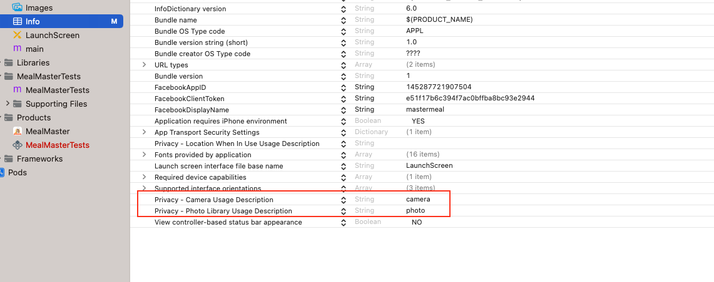

  

- Clean and rebuild again

7. Demo use on JS file
<details>

```js
import {useFormik} from 'formik';
import React, {useState} from 'react';
import {
  Image,
  ScrollView,
  StyleSheet,
  TouchableOpacity,
  View,
} from 'react-native';
import Config from 'react-native-config';
import * as Yup from 'yup';
import {LocalImage, SafeAreaContainer, Text} from '../../components';
import {useMediaPicker} from '../../hooks/useMediaPicker';
import {APP_COLORS} from '../../themes/colors';
import {SCREEN_WIDTH} from '../../utils/constants';

const RecipeScreen = () => {
  const [images, setImages] = useState([]);

  const formik = useFormik({
    initialValues: {
      images: [],
    },
    validationSchema: Yup.object({
      images: Yup.array()

        .min(0, 'Images must have at least one element')
        .required('Please select images'),
    }),
    onSubmit: values => {
      // createRecipe(values);
    },
  });

  const onRemoveImage = index => {
    let item = [...images];
    item.splice(index, 1);
    setImages([...item]);
    formik.setFieldValue('images', images);
  };

  const {showImagePickerOptions} = useMediaPicker(imageResult => {
    if (imageResult?.payload.filename) {
      setImages([...images, imageResult?.payload.filename]);
      formik.setFieldValue('images', images);
    }
  });

  const pickImage = () => {
    showImagePickerOptions();
  };

  const onCreate = () => {
    formik.handleSubmit();
  };

  return (
    <SafeAreaContainer loading={false}>
      <ScrollView>
        <Text type={'bold-20'} style={styles.titleCreate}>
          Create recipe
        </Text>

        <View style={styles.viewAddImage}>
          {images.map((image, index) => {
            return (
              <View key={index} style={styles.imageItem}>
                <TouchableOpacity
                  onPress={() => onRemoveImage(index)}
                  style={styles.icDelete}>
                  <LocalImage
                    imageKey={'icDelete'}
                    style={styles.iconDelete}
                    tintColor={APP_COLORS.error}
                  />
                </TouchableOpacity>
                <Image
                  source={{
                    uri: `${Config.BASE_URL_API}/public/${image}`,
                  }}
                  style={styles.imageFood}
                />
              </View>
            );
          })}
          <TouchableOpacity onPress={pickImage} style={styles.btnAdd}>
            <LocalImage imageKey={'addIcon'} style={styles.addIcon} />
            <Text type={'bold-14'}>Add Image</Text>
          </TouchableOpacity>
          {formik.errors.images && (
            <Text style={styles.textError}>{formik.errors.images} </Text>
          )}
        </View>
      </ScrollView>
      <TouchableOpacity style={styles.btnSave} onPress={() => onCreate()}>
        <Text style={styles.textsave}>Save my receip</Text>
      </TouchableOpacity>
    </SafeAreaContainer>
  );
};
export default RecipeScreen;

const styles = StyleSheet.create({
  iconDelete: {height: 15, width: 15},
  addIcon: {height: 40, width: 40},
  icDelete: {
    alignSelf: 'flex-end',
    position: 'absolute',
    zIndex: 1,
    top: -10,
    backgroundColor: APP_COLORS.white,
    width: 25,
    height: 25,
    alignItems: 'center',
    justifyContent: 'center',
    borderRadius: 20,
  },
  btnAdd: {
    alignItems: 'center',
  },
  imageItem: {
    marginVertical: 10,
    marginHorizontal: 5,
  },
  viewAddImage: {
    flexDirection: 'row',
    alignItems: 'center',
    flexWrap: 'wrap',
  },
  videoView: {
    width: SCREEN_WIDTH - 40,
    height: 200,
    marginBottom: 10,
  },
  body: {
    padding: 20,
  },
  input: {
    marginVertical: 10,
  },
  inputt: {
    marginVertical: 10,
    marginRight: 10,
    color: APP_COLORS.black,
  },
  btnSave: {
    backgroundColor: APP_COLORS.primary,
    borderRadius: 5,
    height: 45,
    justifyContent: 'center',
    alignItems: 'center',
    marginTop: 10,
    marginHorizontal: 20,
    marginBottom: 10,
  },
  textsave: {
    color: APP_COLORS.white,
    fontWeight: 'bold',
    fontSize: 16,
  },
  titleCreate: {
    alignSelf: 'center',
  },

  icCookTime: {
    marginLeft: 20,
    width: 30,
    height: 30,
  },
  textCooktime: {
    fontWeight: 'bold',
    fontSize: 15,
  },
  category: {
    flexDirection: 'row',
  },
  checkboxContainer: {
    marginLeft: 50,
    marginTop: 10,
    marginBottom: 20,
  },
  textcategory: {
    fontWeight: 'bold',
    fontSize: 20,
    marginBottom: 10,
    marginTop: 10,
  },
  inputingredeients: {
    flexDirection: 'row',
  },
  btnIc: {
    display: 'flex',
    justifyContent: 'center',
    alignItem: 'center',
    marginRight: 20,
  },
  icUnion: {
    width: 20,
    height: 20,
    marginLeft: 5,
  },
  imageFood: {
    height: 100,
    width: 100,
  },
  cooktime: {
    flexDirection: 'row',
    backgroundColor: APP_COLORS.popularCategory,
    marginBottom: 10,
    display: 'flex',
    justifyContent: 'space-between',
    alignItems: 'center',
  },
  stepItem: {
    flexDirection: 'row',
  },

  ingredientsInput: {
    width: 180,
    marginVertical: 5,
    maxHeight: 50,
    borderWidth: 1,
    borderRadius: 5,
    borderColor: APP_COLORS.grey,
  },
  ingredientsInput2: {
    width: 120,
    maxHeight: 80,
    marginVertical: 5,
    marginLeft: 10,
    borderWidth: 1,
    borderRadius: 5,
    borderColor: APP_COLORS.grey,
  },
  textError: {
    color: APP_COLORS.error,
  },
  stepContainer: {
    flexDirection: 'row',
    padding: 24,
    backgroundColor: APP_COLORS.popularCategory,
    borderRadius: 20,
    alignItems: 'center',
    marginVertical: 10,
    width: 300,
    height: 100,
  },
  stepNumberContainer: {
    width: 30,
    height: 30,
    backgroundColor: APP_COLORS.white,
    borderRadius: 20,
    justifyContent: 'center',
    alignItems: 'center',
    marginRight: 24,
  },
  stepNumber: {
    fontWeight: 'bold',
  },
  stepInput: {
    textAlign: 'left',
    flex: 1,
  },
  textview: {
    flexDirection: 'row',
  },
});
```

</details>

</details>
